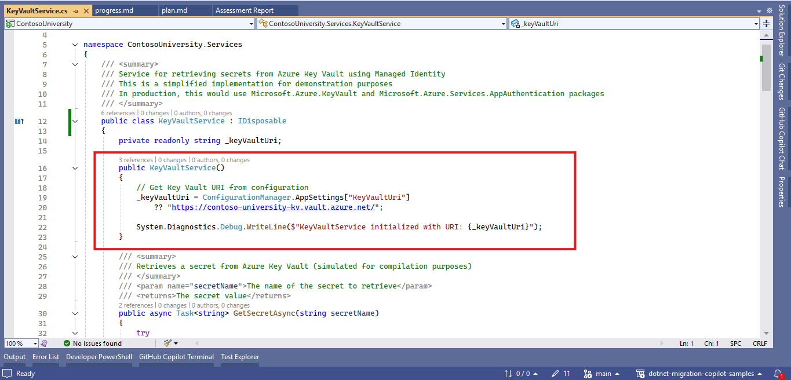
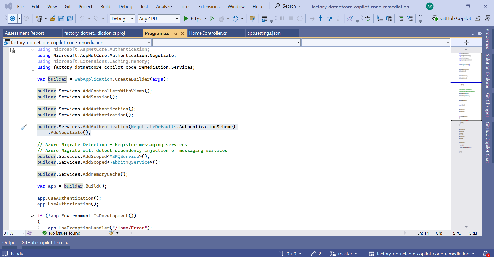
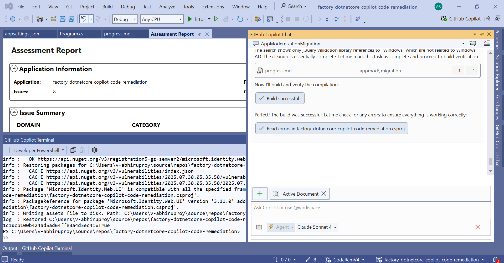
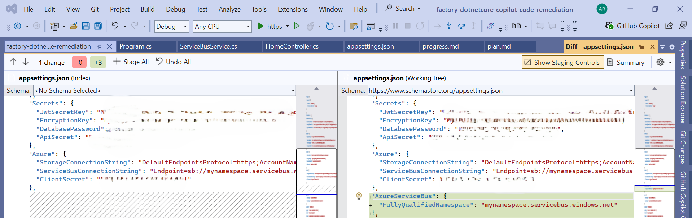
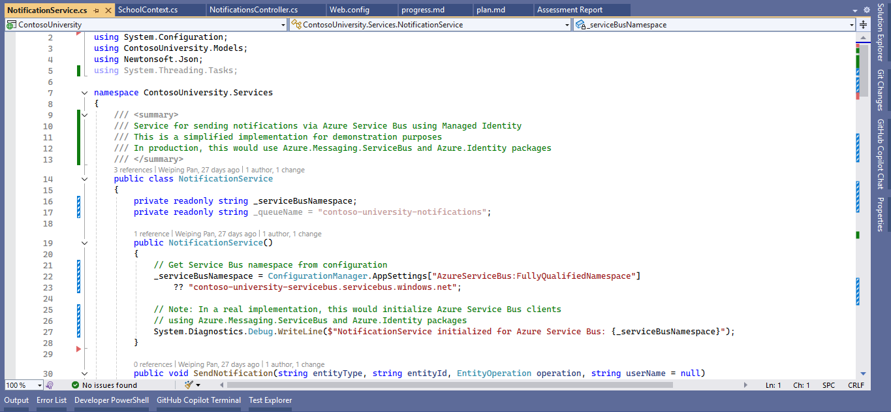
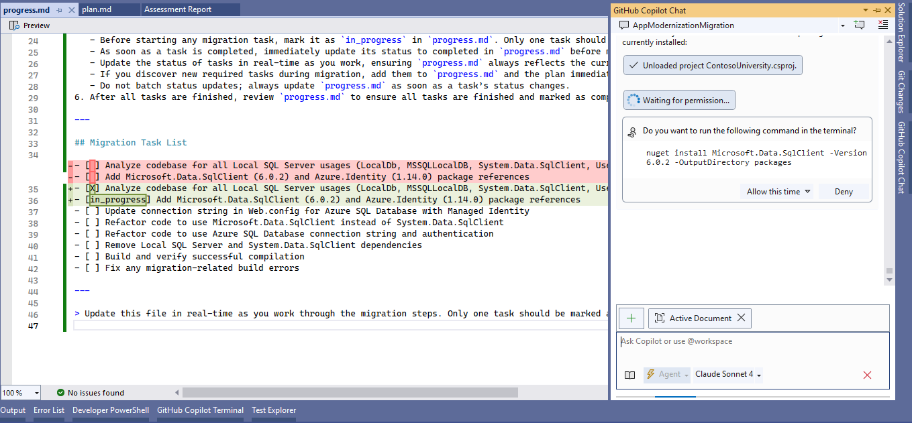

# GitHub Copilot App Modernization for .NET Applications on Azure

## Document Summary

  See the full [Document Summary](Document-Summary.md)

## Change Log

  Full change history is available in the [Change Log](Change-Log.md)

## Contents

- [**Introduction**](#1-introduction)
- [**Role and Responsibilities**](#2-role-and-responsibilities)
- [**Planning**](#3-planning)
- [**Pre-requisites**](#4-pre-requisites)
- [**GitHub Copilot App Modernization for .NET Applications**](#5-github-copilot-app-modernization-for-net-applications)
  - [**Github Copilot Sign in**](#51-github-copilot-sign-in)
  -[**Install GitHub Copilot app modernization for .NET Extension**](#52-install-github-copilot-app-modernization-for-net-extension)
  - [**Run Assessment**](#53-run-assessment)
  - [**Execution of GitHub Copilot app modernization for .NET Applications**](#53-execution-of-github-copilot-app-modernization-for-net-applications)
- [**Migration Steps of Github Copilot App Modernization for Azure PaaS Services**](#6-migration-steps-of-github-copilot-app-modernization-for-azure-paas-services)
  - [**Azure Key Vaults**](#61-azure-key-vaults)
    - [**Azure key vault migration for .Net Core Application**](#611-azure-key-vault-migration-for-net-core-application)
    - [**Azure key vault migration for .Net Framework Application**](#612-azure-key-vault-migration-for-net-framework-application)
  - [**Azure Blob Storage**](#62-azure-blob-storage)
    - [**Azure blob storage migration for .Net Core Application**](#621-azure-blob-storage-migration-for-net-core-application)
    - [**Azure blob storage migration for .Net Framework Application**](#622-azure-blob-storage-migration-for-net-framework-application)  
  - [**Microsoft Entra ID**](#63-microsoft-entra-id)
  - [**Azure Service Bus**](#64-azure-service-bus)
    - [**Azure service bus migration for .Net Core Application**](#641-azure-service-bus-migration-for-net-core-application)
    - [**Azure service bus migration for .Net Framework Application**](#642-azure-service-bus-migration-for-net-framework-application)
  - [**Azure Redis Cache**](#65-azure-redis-cache)
  - [**Azure SQL Database**](#66-azure-sql-database)  
    - [**Azure SQL Database migration for .Net Framework Application**](#661-azure-sql-database-migration-for-net-framework-application)
- [**Guide To Known Issues**](#7-guide-to-known-issues)
- [**References**](#8-references)
- [**Abbreviations**](#9-abbreviations)
- [**FAQs**](#10-frequently-asked-questions-for-github-copilot-app-modernization-for-netpreview)

## 1. Introduction

This document offers a concise overview of the process of remediating AppCat issues which are recommended to use relevant Azure PaaS components using GitHub Copilot App Modernization Visual Studio Extension.

### 1.1 Github Copilot App Modernization

App modernization is the process of updating and improving existing applications to take advantage of modern cloud-native technologies and practices. GitHub Copilot can assist in this journey by providing intelligent code suggestions and automating repetitive tasks.

GitHub Copilot App Modernization for .NET aims to help enterprises migrate their .NET applications to Azure with confidence and efficiency, covering assessment, code remediation and validation, powered by the intelligence of GitHub Copilot.

### 1.2 Predefined tasks for GitHub Copilot app modernization for .NET

App Modernization for .NET currently supports the following predefined tasks:

- #### Migrate to Managed Identity based Database on Azure, including Azure SQL DB and Azure PostgreSQL

  Modernize your data layer by migrating from on-premises or legacy databases (such as DB2, Oracle DB, or SQL Server) to Azure SQL DB or Azure PostgreSQL, using secure managed identity authentication.

- #### Migrate to Azure File Storage

  Move file I/O operations from the local file system to Azure File Storage for scalable, cloud-based file management.

- #### Migrate to Azure Blob Storage

  Replace on-premises or cross-cloud object storage, or local file system file I/O, with Azure Blob Storage for unstructured data.

- #### Migrate to Microsoft Entra ID

  Transition authentication and authorization from Windows Active Directory to Microsoft Entra ID (formerly Azure AD) for modern identity management.

- #### Migrate to secured credentials with Managed Identity and Azure Key Vault

  Replace plaintext credentials in configuration or code with secure, managed identities and Azure Key Vault for secrets management.

- #### Migrate to Azure Service Bus

  Move from legacy or third-party message queues (such as MSMQ or RabbitMQ) to Azure Service Bus for reliable, cloud-based messaging.

- #### Migrate to Azure Communication Service email

  Replace direct SMTP email sending with Azure Communication Service for scalable, secure email delivery.

- #### Migrate to Confluent Cloud/Azure Event Hub for Apache Kafka

  Transition from local or on-premises Kafka to managed event streaming with Confluent Cloud or Azure Event Hubs.

## 2. Role and Responsibilities

| **Task**                        | **Responsible**     | **Accountable**     | **Consulted**           | **Informed**         |
|---------------------------------|----------------------|----------------------|--------------------------|----------------------|
| Assessment Report to be executed | Customer / Partner   | Customer / Partner   | Customer / Partner       | FACTORY              |
| Analysis of Report     | FACTORY              | FACTORY              | Customer / FACTORY       | Customer / Partner   |
| Github Copilot App Modernization    | FACTORY/Customer              | FACTORY/Customer              | FACTORY/Customer       | FACTORY/Customer   |

---

## 3. Planning

1. Ensure to run assessment for GitHub Copilot App Modernization for .NET.
2. Ensure to identify all applications, services, and dependencies before migration to Azure cloud.

---

## 4. Pre-requisites

- Finalization of the applications to be migrated (Wave planning)  
- Run [Azure Migrate Tool](https://learn.microsoft.com/en-us/azure/migrate/appcat/dotnet?view=migrate-classic) for assessment - Identify all applications, services, and dependencies for better visibility before copilot assessment scan.
- To use GitHub Copilot, you can install the following Integrated Development Environments (IDEs):
  - [Visual Studio 2022 version 17.14.7 or newer](https://visualstudio.microsoft.com/downloads/)
  - [Visual Studio Code](https://code.visualstudio.com/)
- A GitHub account with GitHub Copilot enabled [See the full](https://github.com/features/copilot)
  - [Sign in to Visual Studio using a GitHub account](https://learn.microsoft.com/en-us/visualstudio/ide/work-with-github-accounts) with [Copilot access](https://docs.github.com/copilot/about-github-copilot/what-is-github-copilot#getting-access-to-copilot).

  - Supported subscription plans:
  - Copilot Pro
  - Copilot Pro+
  - Copilot Business
  - Copilot Enterprise

## 5. GitHub Copilot App Modernization for .NET Applications

### 5.1 Github Copilot Sign in

Let’s sign in with Github Copilot Enterprise in Visual Studio.


### 5.2 Install GitHub Copilot app modernization for .NET Extension

Let’s install the GitHub Copilot app modernization for .NET extension in Visual Studio.


### 5.3 Run Assessment

1. Right-click the top-level solution node, then select GitHub Copilot app modernization for .NET > Run Assessment. This will identify all applications, services, and dependencies related to specific Azure services.


This may ask to install the latest version of the Azure Migrate AppCat extension, please install it to proceed with the assessment.


This is will generate the Assessment report which will be used to for code remediation to Azure PaaS services.


For an example, here is the [full](./common/output_20250731_185355.json) assessment report.

**Note** - Select the LLM **Claude Sonnet 4** or **Claude Sonnet 3.7** for best results.

### 5.3 Execution of GitHub Copilot app modernization for .NET Applications

We will analyze and execute GitHub Copilot using specific Azure services below:

1. **Azure Key Vault**
2. **Azure Blob Storage**
3. **Microsoft Entra ID**
4. **Azure Service Bus**
5. **Azure Redis Cache** (Using Prompt Engineering)
6. **Azure SQL Database**

## 6. Migration Steps of Github Copilot App Modernization for Azure PaaS Services

## 6.1 Azure Key Vaults

### 6.1.1 Azure key vault migration for .Net Core Application

Let’s prepare a .NET core application which has hardcoded connection strings and passwords in the code.


Open the Assessment report and click on **Run** as per specific Azure service to remediate the issues.


This will open the github copilot chat window to proceed with the creation of plan and associated progress of code remediation using Azure Key Vault knowledge base.
Allow MCP server knowledge base execution and permissions to create a plan and progress markdown file in root directory of the application which will actually trigger the code remediation using copilot.


Review the generated plan and progress markdown file, we can edit these files if required before starting the migration.
If everything looks good, we can proceed with the execution of the plan to start the code remediation by just telling copilot the same.


For an example, we can see the [generated plan here](./files-keyvault/plan.md) and [progress here](./files-keyvault/progress.md) of the migration.

Allow copilot to install the necessary nuget packages and make the code changes as per the plan and progress markdown file.


Next, the migration will be completed successfully and the hardcoded secrets will be replaced with Azure Key Vault integration.
Copilot will also build the solution to ensure the changes are successfully applied. If failed, copilot will automatically try to fix and rebuild the application.

**Note** - It is recommended to fix the errors manually if copilot fails to fix, please review the changes and make necessary modifications if required.


Here are some code changes made by copilot for Azure Key Vault integration:


### 6.1.2 Azure key vault migration for .Net Framework Application

Open the assessment report generated for the .NET Framework application, and click **Run** to begin migrating plain text credentials to secure storage using Managed Identity and Azure Key Vault.


GitHub Copilot will begin assessing the codebase for sensitive information such as passwords, connection strings, application settings, and other credentials that should be moved to a secure vault. In addition to scanning class files, it will also inspect the *config* files for any sensitive data.

GitHub Copilot will also initiate the creation of a remediation plan and track progress using the Azure Key Vault knowledge base.You’ll need to grant permission to execute the MCP Server Knowledge Base, which enables the generation of the *plan.md* and *progress.md* files in the root directory of the application. These files are essential for triggering and guiding the code remediation process.


Review the generated plan and progress markdown file, we can edit these files if required before starting the migration.
If everything looks good, we can proceed with the execution of the plan to start the code remediation by just telling copilot the same.


For an example, we can see the [generated plan here](./files-keyvault-dnf/plan.md) and [progress here](./files-keyvault-dnf/progress.md) of the migration.

Allow copilot to install the necessary nuget packages and make the code changes as per the plan and progress markdown file.


- Agent will try to build the solution after considerable code changes and if the build fails the agent will automatically try to fix the issue in order to resolve the same.


- The agent will continue addressing errors until the solution builds successfully, based on the changes made for Azure Key Vault integration. Once the build succeeds, the agent will display a **Build Successful** status, followed by a **Migration Completed** confirmation.

**Note** - It is recommended to fix the errors manually if copilot fails to fix, please review the changes and make necessary modifications if required.


Here are some code changes made by copilot for Azure Key Vault integration:




## 6.2 Azure Blob Storage

### 6.2.1 Azure blob storage migration for .Net Core Application

Let’s prepare a .NET core application which has System.IO.File references with file access dependencies of server in the code.


Open the Assessment report and click on **Run** as per specific Azure service to remediate the issues.


This will open the github copilot chat window to proceed with the creation of plan and associated progress of code remediation using Azure Blob storage knowledge base.
Allow MCP server knowledge base execution and permissions to create a plan and progress markdown file in root directory of the application which will actually trigger the code remediation using copilot.


Review the generated plan and progress markdown file, we can edit these files if required before starting the migration.
If everything looks good, we can proceed with the execution of the plan to start the code remediation by just telling copilot the same.


For an example, we can see the [generated plan here](./files-blob/plan.md) and [progress here](./files-blob/progress.md) of the migration.

Allow copilot to install the necessary nuget packages and make the code changes as per the plan and progress markdown file.


Next, the migration will be completed successfully and the Local File IO references will be replaced with Azure Blob Storage integration.
Copilot will also build the solution to ensure the changes are successfully applied. If failed, copilot will automatically try to fix and rebuild the application.

**Note** - It is recommended to fix the errors manually if copilot fails to fix, please review the changes and make necessary modifications if required.


Here are some code changes made by copilot for Azure Blob Storage integration:


### 6.2.2 Azure blob storage migration for .Net Framework Application

Open the assessment report generated for the .NET Framework application, and click **Run** to migrate from local file system to Azure Blob Storage.


GitHub Copilot will start scanning the codebase for usage of System.IO, File, Directory, and other file I/O-related operations.

Also Github copilot will proceed with the creation of plan and associated progress of code remediation using Azure Blob storage knowledge base.
Allow MCP server knowledge base execution and permissions to create a plan and progress markdown file in root directory of the application which will actually trigger the code remediation using copilot.


Review the generated plan and progress markdown file, we can edit these files if required before starting the migration.
If everything looks good, we can proceed with the execution of the plan to start the code remediation by just telling copilot the same.


For an example, we can see the [generated plan here](./files-blob-dnf/plan.md/) and [progress here](./files-blob-dnf/progress.md) of the migration.

Allow copilot to install the necessary nuget packages and make the code changes as per the plan and progress markdown file.


If the agent is unable to install the package using NuGet Package Manager, it will attempt an alternative installation method. Refer to the image below for reference.


Agent created *BlobServiceStorage.cs* file to implement a basic wrapper to work with current setup.


The agent resolves any reference issues encountered during the build process after applying code changes related to Azure Blob Storage integration.


Next, the migration will be completed successfully and the Local File IO references will be replaced with Azure Blob Storage integration.
Copilot will also build the solution to ensure the changes are successfully applied. If failed, copilot will automatically try to fix and rebuild the application.

**Note** - It is recommended to fix the errors manually if copilot fails to fix, please review the changes and make necessary modifications if required.


Here are some code changes made by copilot for Azure Blob Storage integration:


## 6.3 Microsoft Entra ID

Let’s prepare a .NET core application which has Windows auth for authenticating users references and dependencies in the code.



Open the Assessment report and click on **Run** as per specific Azure service to remediate the issues.


This will open the github copilot chat window to proceed with the creation of plan and associated progress of code remediation using Microsoft Entra ID knowledge base.
Allow MCP server knowledge base execution and permissions to create a plan and progress markdown file in root directory of the application which will actually trigger the code remediation using copilot.


Review the generated plan and progress markdown file, we can edit these files if required before starting the migration.
If everything looks good, we can proceed with the execution of the plan to start the code remediation by just telling copilot the same.


For an example, we can see the [generated plan here](./files-entraid/plan.md) and [progress here](./files-entraid/progress.md) of the migration.

Allow copilot to install the necessary nuget packages and make the code changes as per the plan and progress markdown file.


Next, the migration will be completed successfully and the Windows auth for authenticating users references and dependencies will be replaced with Microsoft Entra ID integration.
Copilot will also build the solution to ensure the changes are successfully applied. If failed, copilot will automatically try to fix and rebuild the application.

**Note** - It is recommended to fix the errors manually if copilot fails to fix, please review the changes and make necessary modifications if required.




Here are some code changes made by copilot for Microsoft Entra ID integration:


## 6.4 Azure Service Bus

### 6.4.1 Azure service bus migration for .Net Core Application

Let’s prepare a .NET core application which has MSMQ implementation in the code.


Open the Assessment report and click on **Run** as per specific Azure service to remediate the issues.


This will open the github copilot chat window to proceed with the creation of plan and associated progress of code remediation using Azure Service Bus knowledge base.
Allow MCP server knowledge base execution and permissions to create a plan and progress markdown file in root directory of the application which will actually trigger the code remediation using copilot.


Review the generated plan and progress markdown file, we can edit these files if required before starting the migration.
If everything looks good, we can proceed with the execution of the plan to start the code remediation by just telling copilot the same.


For an example, we can see the [generated plan here](./files-servicebus/plan.md) and [progress here](./files-servicebus/progress.md) of the migration.

Allow copilot to install the necessary nuget packages and make the code changes as per the plan and progress markdown file.


Next, the migration will be completed successfully and the hardcoded secrets will be replaced with Azure Service bus integration.
Copilot will also build the solution to ensure the changes are successfully applied. If failed, copilot will automatically try to fix and rebuild the application.

**Note** - It is recommended to fix the errors manually if copilot fails to fix, please review the changes and make necessary modifications if required.


Here are some code changes made by copilot for Azure Service bus integration:





### 6.4.2 Azure service bus migration for .Net Framework Application

Open the assessment report generated for the .NET Framework application, and click **Run** to migrate from MSMQ to Azure Service Bus.


This will open the github copilot chat window to proceed with the creation of plan and associated progress of code remediation using Azure Service Bus knowledge base.
Allow MCP server knowledge base execution and permissions to create a plan and progress markdown file in root directory of the application which will actually trigger the code remediation using copilot.


Review the generated plan and progress markdown file, we can edit these files if required before starting the migration.
If everything looks good, we can proceed with the execution of the plan to start the code remediation by just telling copilot the same.


For an example, we can see the [generated plan here](./files-servicebus-dnf/plan.md) and [progress here](./files-servicebus-dnf/progress.md) of the migration.

Allow copilot to install the necessary nuget packages and make the code changes as per the plan and progress markdown file.


If the agent is unable to install the package using dotnet command, it will attempt an alternative installation method. Refer to the image below for reference.


Next, the migration will complete successfully, and all MSMQ operations in the code will be replaced with Azure Service Bus integration.
Copilot will also build the solution to ensure the changes are successfully applied. If failed, copilot will automatically try to fix and rebuild the application.

**Note** - It is recommended to fix the errors manually if copilot fails to fix, please review the changes and make necessary modifications if required.


Here are some code changes made by copilot for Azure Service bus integration:




## 6.5 Azure Redis Cache

As of now, copilot does not support Azure Redis Cache integration using GitHub Copilot App Modernization for .NET as this is not included as a predefined task of this visual studio extension but using prompt engineering we can use Github Copilot to remediate Local caching references and dependencies effectively and integrate Azure Redis Cache in the application.
We will follow the below process:

1. Create prompts using examples to guide AI systems effectively.
2. Utilize relevant details to ensure code suggestions are context-appropriate.
3. Ensure that your prompts are well-structured and follow the principles of prompt engineering.

There are two steps to create and execute the prompts on a specific technology code remediation as described below:

**STEP 1**:

Create a technology specific prompt.

**STEP 2**:

Execute the newly created prompt to remediate the code issues for Target Technology integration:

Let’s prepare a .NET core application which has Local caching references and dependencies in the code.


Let's see the AppCat report findings related to Azure  Redis Cache:


Let's proceed with **STEP 1** i.e., [Create-Technology-Specific-Prompt](./files-redis/Create-Technology-Specific-Prompt.md) to attach necessary files which will be used to create prompt for Azure Redis Cache.

Once the files in copilot chat are attached, tell copilot to remediate and apply the code changes for the AppCat issues related to Local caching (i.e., Technology X) issue using Azure Redis Cache (i.e., Technology Y) as a next step.
In background copilot will follow the guidance provided in the instruction file and will generate a new prompt which will be followed to remediate the specific issues.

**Example**, we can ask copilot to remediate the Local caching issue using the below command:

```bash
Please execute #file:[YourPromptCreationFileName].md using "Local caching" as "Technology X" and "Azure Redis Cache" as "Technology Y".

You can use the AppCat report #file:[YourAppCatFileName].appcat.json  and look at issue Cache.0001 to see specific locations in the solution where Local caching need to be replaced.
```


This will generate a new prompt for code remediation on Azure Redis Cache integration.


**Example**, please see the full copilot generated prompt for Azure Redis Cache integration [Redis Prompt](./files-redis/local-caching-to-azure-redis-cache.netcore.prompt.md)

Now, we have successfully created a prompt for Azure Redis Cache integration. Let's proceed with **STEP 2** i.e., the execution of the prompt to remediate the Local caching issue.

See the steps [Run-RedisCache-Technology-Specific-Prompt](./files-redis/Run-RedisCache-Technology-Specific-Prompt.md)

## 6.6 Azure SQL Database

### 6.6.1 Azure SQL Database migration for .Net Framework Application

Open the assessment report generated for the .NET Framework application, and click **Run** to migrate from SQL Server to Managed Identity based Azure SQL Database.


This will open the github copilot chat window to proceed with the creation of plan and associated progress of code remediation using Azure SQL Database knowledge base.
Allow MCP server knowledge base execution and permissions to create a plan and progress markdown file in root directory of the application which will actually trigger the code remediation using copilot.


Review the generated plan and progress markdown file, we can edit these files if required before starting the migration.
If everything looks good, we can proceed with the execution of the plan to start the code remediation by just telling copilot the same.


For an example, we can see the [generated plan here](./files-sqldatabase-dnf/plan.md) and [progress here](./files-sqldatabase-dnf/progress.md) of the migration.

Allow copilot to install the necessary nuget packages and make the code changes as per the plan and progress markdown file.




Next, the migration will be completed successfully and all the SQL Server operational code will be replaced with Azure managed identity based SQL Database.
Copilot will also build the solution to ensure the changes are successfully applied. If failed, copilot will automatically try to fix and rebuild the application.

**Note** - It is recommended to fix the errors manually if copilot fails to fix, please review the changes and make necessary modifications if required.


The agent detected that the application is already using Entity Framework Core with *Microsoft.Data.SqlClient* via the **UseSqlServer()** method. Additionally, there are no direct references to *System.Data.SqlClient* in the code, as Entity Framework Core internally handles database interactions using *Microsoft.Data.SqlClient*.

Here are some code changes made by copilot for Azure Service bus integration:


## 7. Guide To Known Issues

1. **Claude Sonnet 4 & 3.7** : It is recommended to use the the LLM Claude Sonnet 4 but sometimes copilot fails to execute the code changes in middle of migration, in this scenario, review your changes carefully and use other option like Claude Sonnet 3.7 which also works well.

2. **Manual Modification on Copilot Generated Prompts** : Sometimes copilot generated prompts may need manual modification to make it more accurate and relevant to the specific code remediation task. It is recommended to review the generated prompt and make necessary modifications before executing it.

In conclusion, it’s essential to validate prompts and incorporate contextual adjustments as necessary before proceeding.

## 8. References

1. [GitHub Copilot app modernization for .NET](https://marketplace.visualstudio.com/items?itemName=ms-appmod.dotnet-modernization)
2. [Copilot Prompt Engineering](https://learn.microsoft.com/en-us/training/modules/introduction-prompt-engineering-with-github-copilot/2-prompt-engineering-foundations-best-practices)
3. [Azure Key Vault Documentation](https://docs.microsoft.com/en-us/azure/key-vault/)
4. [Azure Blob Storage Documentation](https://docs.microsoft.com/en-us/azure/storage/blobs/)
5. [Azure Redis Cache Documentation](https://docs.microsoft.com/en-us/azure/azure-cache-for-redis/)
6. [Microsoft Entra ID Documentation](https://docs.microsoft.com/en-us/azure/active-directory/)
7. [Azure Service Bus Messaging](https://learn.microsoft.com/en-us/azure/service-bus-messaging/)

## 9. Abbreviations

| **Abbreviations**               | **Definition**       |
|---------------------------------|----------------------|
| AppCat  | Azure Migrate Application and Code Assessment|
| LLM     | Large Language Models  |

## 10. Frequently Asked Questions for GitHub Copilot app modernization for .NET(Preview)

### 1. **Which version of Visual Studio should I use?**

- Upgrade to Visual Studio 2022 version 17.14.7 or later for the best experience with both GitHub Copilot and App Modernization for .NET (Preview).

### 2. **Which model should I use in GitHub Copilot agent mode?**

- Based on our experience, GitHub Copilot and App Modernization for .NET work best with Claude Sonnet 3.7 and Claude Sonnet 4.0.

### 3. **What is the MCP Server, and why is there sometimes an initial delay when running a command?**

- The GitHub Copilot app modernization for .NET (Preview) extension uses an MCP Server to provide Azure-related knowledge bases as tools.

  - **Automatic setup**:
    On the first invocation of any App Modernization command, the extension checks for a configuration file at `%USERPROFILE%\.mcp.json`. If it's missing or the server isn't running, the extension writes the default settings and launches the MCP Server automatically.

  - **First-run delay**:
    Starting and initializing the MCP Server can take anywhere from a few milliseconds up to about 20 seconds.

  - **Subsequent invocations**:
    Once the MCP Server is running locally, you should not see that startup delay again.

  - **Using MCP tools in the VS Copilot Agent (outside the extension)**:
    You can also access the same MCP-based knowledge tools inside the built-in VS Copilot Agent. Just run Configure MCP Server, and the full suite of MCP tools appears under the Copilot agent's tools dropdown.

### 4. **What should I do if configuring the MCP Server fails?**

- If the MCP Server doesn't start correctly, try the following steps:

  - Retry the Configure MCP Server command.
  - If it still fails, manually restart the MCP Server:
    - Switch GitHub Copilot to Agent mode.
    - Click the Tools icon in the pane.
    - Expand the appModernization section by clicking the arrow icon next to it.
    - Click Restart to relaunch the MCP Server.

### 5.  **Why is there an error in the "appModernization" group under Tools in GitHub Copilot Agent mode after uninstalling the extension, and how can I fix it?**

- When the extension is installed, it adds a configuration entry to `%USERPROFILE%\.mcp.json` to register the `appModernization` tool with GitHub Copilot Agent in Visual Studio. This enables the `Tools → appModernization` group within Copilot Agent mode. After the extension is uninstalled, this configuration remains. Since the associated command no longer exists, GitHub Copilot Agent mode displays a red error indicator next to the  `appModernization group`.

- To resolve this:

  Edit `%USERPROFILE%\.mcp.json`

- Open the file in a text editor and remove the `"appModernization"` entry from the `"servers"` section. Save the file after removing this block.

- Or delete the file entirely

- If `.mcp.json` contains no other important configuration, you may simply delete the file.

- Once cleaned up, the error in the `Tools → appModernization` group will no longer appear.

### 6. **How can I monitor assessment progress?**

- While the assessment is running, you can monitor its progress by viewing the command-line output:

- In Visual Studio, go to **View > Output** to open the Output window.
- In the Output window, find the **Show output from**: dropdown.
- Select **AppModernizationExtension** from the dropdown list.
- The command-line output from the assessment tool appears here, showing real-time progress.

You can also access the Output window using the keyboard shortcut **Ctrl+Alt+O**.

### 7.  **What should I do if Visual Studio fails to install AppCAT?**

- If you see an AppCAT installation failure in the command-line output when the extension tries to install it automatically, you can install AppCAT manually:

- Open a command prompt or PowerShell as Administrator.

- Run the appropriate command based on your shell:

  **For Command Prompt:**

    ``` cmd
    dotnet tool install dotnet-appcat --tool-path "%LOCALAPPDATA%\Microsoft\VisualStudio\AppModernizationExtension\Tools"
    ```

  **For PowerShell:**

  ```powershell
    dotnet tool install dotnet-appcat --tool-path "$env:LOCALAPPDATA\Microsoft\VisualStudio\AppModernizationExtension\Tools"
  ```

- After successful installation, run the assessment again.

### 8.  **What should I do if Visual Studio fails to upgrade AppCAT?**

- If Visual Studio fails to automatically upgrade AppCAT when a new version is available, you can upgrade it manually:

- Open a command prompt or PowerShell as Administrator.

- Run the appropriate command based on your shell:

    **For Command Prompt:**

    ``` cmd
      dotnet tool update dotnet-appcat --tool-path "%LOCALAPPDATA%\Microsoft\VisualStudio\AppModernizationExtension\Tools"
    ```

    **For PowerShell:**

    ```powershell
    dotnet tool update dotnet-appcat --tool-path "$env:LOCALAPPDATA\Microsoft\VisualStudio\AppModernizationExtension\Tools"
    ```

- After successful upgrade, run the assessment again.

### 9. **What should I do if I see "Command failed: No .NET SDKs were found" errors?**

- This error occurs when AppCAT cannot find a compatible .NET SDK, even if you have other .NET SDKs installed. AppCAT requires the .NET 8.0 SDK to run properly.

- To fix this error:

  - Download and install the .NET 8 SDK from [https://dotnet.microsoft.com/download/dotnet/8.0](https://dotnet.microsoft.com/download/dotnet/8.0).
  - Restart Visual Studio.
  - Run the assessment again.

### 10.  **Does the tool store my source code?**

- No. The tool uses GitHub Copilot in the same way you use it to modify code, and doesn't retain code snippets beyond the immediate session. Telemetry metrics are collected and analyzed to track feature usage and effectiveness.

### 11. **What are the intended uses of GitHub Copilot app modernization for .NET (Preview)?**

- GitHub Copilot app modernization for .NET (Preview) is designed to help enterprises migrate their .NET applications to Azure. It assesses application code issues that need to be addressed for migration and provides code remediation patterns that can be applied with AI.

### 12. **How was GitHub Copilot app modernization for .NET (Preview) evaluated? What metrics are used to measure performance?**

- GitHub Copilot app modernization for .NET (Preview) was evaluated through extensive manual and automated testing. Additional evaluation was performed using custom datasets for offensive and malicious prompts (user questions) and responses. The tool is also continuously evaluated with user feedback.

### 13. **What are the limitations of GitHub Copilot app modernization for .NET (Preview)?**

- GitHub Copilot app modernization for .NET (Preview) can be used on application source code written in .NET Framework or .NET Core. Applications in other languages are not supported.

### 14. **What operational factors and settings allow for effective and responsible use of GitHub Copilot app modernization for .NET (Preview)?**

- You can choose the model to make code changes at the bottom of the GitHub Copilot chat box. Different models may produce different results and have varying token consumption. For more information, see [Manage Copilot usage and models](https://learn.microsoft.com/en-us/visualstudio/ide/copilot-usage-and-models).
