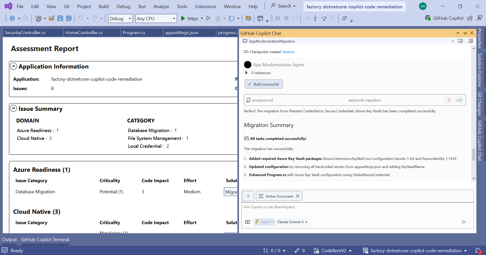
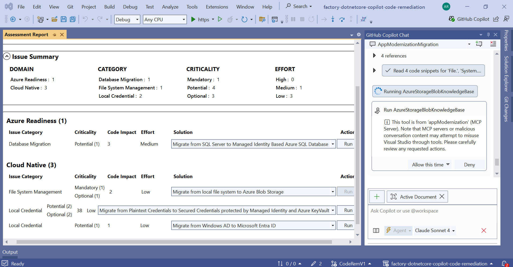
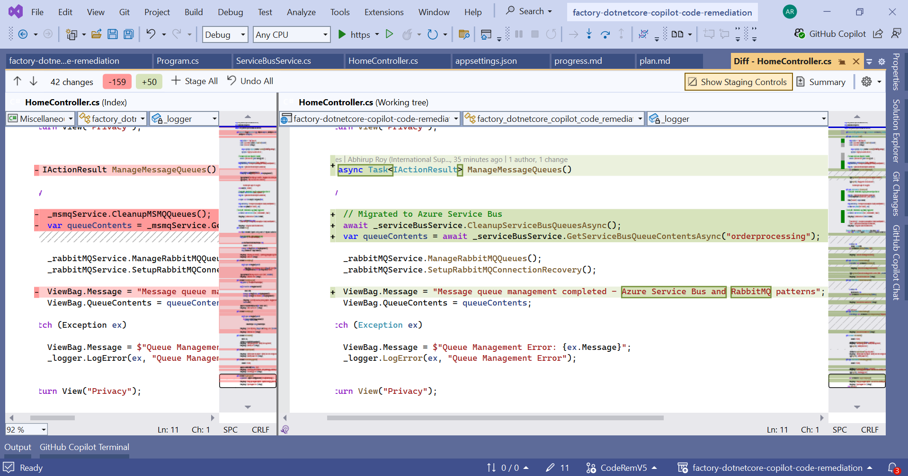

# GitHub Copilot App Modernization for .NET Core Applications on Azure


## Document Summary
  See the full [Document Summary](Document-Summary.md)
## Change Log
  Full change history is available in the [Change Log](Change-Log.md)


## Contents

- [**Introduction**](#1-introduction)
- [**Role and Responsibilities**](#2-role-and-responsibilities)
- [**Planning**](#3-planning)
- [**Pre-requisites**](#4-pre-requisites)
- [**GitHub Copilot App Modernization for .NET Core**](#5-github-copilot-app-modernization-for-net-core)
- [**Migration Steps of Github Copilot App Modernization for Azure PaaS Services**](#6-migration-steps-of-github-copilot-app-modernization-for-azure-paas-services)
- [**Guide To Known Issues**](#7-guide-to-known-issues)
- [**References**](#8-references)
- [**Abbreviations**](#9-abbreviations)


## 1. Introduction

This document offers a concise overview of the process of remediating AppCat issues which are recommended to use relevant Azure PaaS components using GitHub Copilot App Modernization Visual Studio Extension.

### 1.1 Github Copilot App Modernization

App modernization is the process of updating and improving existing applications to take advantage of modern cloud-native technologies and practices. GitHub Copilot can assist in this journey by providing intelligent code suggestions and automating repetitive tasks.

GitHub Copilot App Modernization for .NET aims to help enterprises migrate their .NET applications to Azure with confidence and efficiency, covering assessment, code remediation and validation, powered by the intelligence of GitHub Copilot.


### 1.2 Predefined tasks for GitHub Copilot app modernization for .NET

App Modernization for .NET currently supports the following predefined tasks:

- #### Migrate to Managed Identity based Database on Azure, including Azure SQL DB and Azure PostgreSQL

  Modernize your data layer by migrating from on-premises or legacy databases (such as DB2, Oracle DB, or SQL Server) to Azure SQL DB or Azure PostgreSQL, using secure managed identity authentication.

- #### Migrate to Azure File Storage

  Move file I/O operations from the local file system to Azure File Storage for scalable, cloud-based file management.

- #### Migrate to Azure Blob Storage

  Replace on-premises or cross-cloud object storage, or local file system file I/O, with Azure Blob Storage for unstructured data.

- #### Migrate to Microsoft Entra ID

  Transition authentication and authorization from Windows Active Directory to Microsoft Entra ID (formerly Azure AD) for modern identity management.

- #### Migrate to secured credentials with Managed Identity and Azure Key Vault

  Replace plaintext credentials in configuration or code with secure, managed identities and Azure Key Vault for secrets management.

- #### Migrate to Azure Service Bus

  Move from legacy or third-party message queues (such as MSMQ or RabbitMQ) to Azure Service Bus for reliable, cloud-based messaging.

- #### Migrate to Azure Communication Service email

  Replace direct SMTP email sending with Azure Communication Service for scalable, secure email delivery.

- #### Migrate to Confluent Cloud/Azure Event Hub for Apache Kafka

  Transition from local or on-premises Kafka to managed event streaming with Confluent Cloud or Azure Event Hubs.

## 2. Role and Responsibilities

| **Task**                        | **Responsible**     | **Accountable**     | **Consulted**           | **Informed**         |
|---------------------------------|----------------------|----------------------|--------------------------|----------------------|
| Assessment Report to be executed | Customer / Partner   | Customer / Partner   | Customer / Partner       | FACTORY              |
| Analysis of Report     | FACTORY              | FACTORY              | Customer / FACTORY       | Customer / Partner   |
| Github Copilot App Modernization    | FACTORY/Customer              | FACTORY/Customer              | FACTORY/Customer       | FACTORY/Customer   |

---

## 3. Planning

1. Ensure to run assessment for GitHub Copilot App Modernization for .NET.
2. Ensure to identify all applications, services, and dependencies before migration to Azure cloud.

---

## 4. Pre-requisites

- Finalization of the applications to be migrated (Wave planning)  
- Run [Azure Migrate Tool](https://learn.microsoft.com/en-us/azure/migrate/appcat/dotnet?view=migrate-classic) for assessment - Identify all applications, services, and dependencies for better visibility before copilot assessment scan.
- To use GitHub Copilot, you can install the following Integrated Development Environments (IDEs):
  - [Visual Studio 2022 version 17.14.7 or newer](https://visualstudio.microsoft.com/downloads/)
  - [Visual Studio Code](https://code.visualstudio.com/)
- A GitHub account with GitHub Copilot enabled [See the full](https://github.com/features/copilot)
  - [Sign in to Visual Studio using a GitHub account](https://learn.microsoft.com/en-us/visualstudio/ide/work-with-github-accounts) with [Copilot access](https://docs.github.com/copilot/about-github-copilot/what-is-github-copilot#getting-access-to-copilot).
 - Supported subscription plans:
  - Copilot Pro
  - Copilot Pro+
  - Copilot Business
  - Copilot Enterprise


## 5. GitHub Copilot App Modernization for .NET Core

## 5.1 Github Copilot Sign in

Let’s sign in with Github Copilot Enterprise in Visual Studio.


## 5.2 Install GitHub Copilot app modernization for .NET Extension:

Let’s install the GitHub Copilot app modernization for .NET extension in Visual Studio.


## 5.3 Run Assessment:

1. Right-click the top-level solution node, then select GitHub Copilot app modernization for .NET > Run Assessment. This will identify all applications, services, and dependencies related to specific Azure services.


This may ask to install the latest version of the Azure Migrate AppCat extension, please install it to proceed with the assessment.


This is will generate the Assessment report which will be used to for code remediation to Azure PaaS services.


For an example, here is the [full](./common/output_20250731_185355.json) assessment report.

**Note** - Select the LLM **Claude Sonnet 4** or **Claude Sonnet 3.7** for best results.

## 5.3 Execution of GitHub Copilot app modernization for .NET Core:

We will analyze and execute GitHub Copilot using specific Azure services below:

1. **Azure Key Vault**
2. **Azure Blob Storage**
3. **Microsoft Entra ID**
4. **Azure Service Bus**
5. **Azure Redis Cache** (Using Prompt Engineering)


## 6. Migration Steps of Github Copilot App Modernization for Azure PaaS Services

## 6.1 Azure Key Vaults:

Let’s prepare a .NET core application which has hardcoded connection strings and passwords in the code.


Open the Assessment report and click on **Run** as per specific Azure service to remediate the issues.


This will open the github copilot chat window to proceed with the creation of plan and associated progress of code remediation using Azure Key Vault knowledge base.
Allow MCP server knowledge base execution and permissions to create a plan and progress markdown file in root directory of the application which will actually trigger the code remediation using copilot.


Review the generated plan and progress markdown file, we can edit these files if required before starting the migration.
If everything looks good, we can proceed with the execution of the plan to start the code remediation by just telling copilot the same.


For an example, we can see the generated plan [here](./files-keyvault/plan.md) and progress [here](./files-keyvault/progress.md) of the migration.

Allow copilot to install the necessary nuget packages and make the code changes as per the plan and progress markdown file.


Next, the migration will be completed successfully and the hardcoded secrets will be replaced with Azure Key Vault integration.
Copilot will also build the solution to ensure the changes are successfully applied. If failed, copilot will automatically try to fix and rebuild the application.

**Note** - It is recommended to fix the errors manually if copilot fails to fix, please review the changes and make necessary modifications if required.



Here are some code changes made by copilot for Azure Key Vault integration:


## 6.2 Azure Blob Storage:

Let’s prepare a .NET core application which has System.IO.File references with file access dependencies of server in the code.


Open the Assessment report and click on **Run** as per specific Azure service to remediate the issues.


This will open the github copilot chat window to proceed with the creation of plan and associated progress of code remediation using Azure Blob storage knowledge base.
Allow MCP server knowledge base execution and permissions to create a plan and progress markdown file in root directory of the application which will actually trigger the code remediation using copilot.




Review the generated plan and progress markdown file, we can edit these files if required before starting the migration.
If everything looks good, we can proceed with the execution of the plan to start the code remediation by just telling copilot the same.


For an example, we can see the generated plan [here](./files-blob/plan.md) and progress [here](./files-blob/progress.md) of the migration.

Allow copilot to install the necessary nuget packages and make the code changes as per the plan and progress markdown file.


Next, the migration will be completed successfully and the Local File IO references will be replaced with Azure Blob Storage integration.
Copilot will also build the solution to ensure the changes are successfully applied. If failed, copilot will automatically try to fix and rebuild the application.

**Note** - It is recommended to fix the errors manually if copilot fails to fix, please review the changes and make necessary modifications if required.


Here are some code changes made by copilot for Azure Blob Storage integration:


## 6.3 Microsoft Entra ID:

Let’s prepare a .NET core application which has Windows auth for authenticating users references and dependencies in the code.


Open the Assessment report and click on **Run** as per specific Azure service to remediate the issues.


This will open the github copilot chat window to proceed with the creation of plan and associated progress of code remediation using Microsoft Entra ID knowledge base.
Allow MCP server knowledge base execution and permissions to create a plan and progress markdown file in root directory of the application which will actually trigger the code remediation using copilot.


Review the generated plan and progress markdown file, we can edit these files if required before starting the migration.
If everything looks good, we can proceed with the execution of the plan to start the code remediation by just telling copilot the same.


For an example, we can see the generated plan [here](./files-entraid/plan.md) and progress [here](./files-entraid/progress.md) of the migration.

Allow copilot to install the necessary nuget packages and make the code changes as per the plan and progress markdown file.


Next, the migration will be completed successfully and the Windows auth for authenticating users references and dependencies will be replaced with Microsoft Entra ID integration.
Copilot will also build the solution to ensure the changes are successfully applied. If failed, copilot will automatically try to fix and rebuild the application.

**Note** - It is recommended to fix the errors manually if copilot fails to fix, please review the changes and make necessary modifications if required.


Here are some code changes made by copilot for Microsoft Entra ID integration:


## 6.4 Azure Service Bus:

Let’s prepare a .NET core application which has MSMQ implementation in the code.


Open the Assessment report and click on **Run** as per specific Azure service to remediate the issues.


This will open the github copilot chat window to proceed with the creation of plan and associated progress of code remediation using Azure Service Bus knowledge base.
Allow MCP server knowledge base execution and permissions to create a plan and progress markdown file in root directory of the application which will actually trigger the code remediation using copilot.


Review the generated plan and progress markdown file, we can edit these files if required before starting the migration.
If everything looks good, we can proceed with the execution of the plan to start the code remediation by just telling copilot the same.


For an example, we can see the generated plan [here](./files-servicebus/plan.md) and progress [here](./files-servicebus/progress.md) of the migration.

Allow copilot to install the necessary nuget packages and make the code changes as per the plan and progress markdown file.


Next, the migration will be completed successfully and the hardcoded secrets will be replaced with Azure Service bus integration.
Copilot will also build the solution to ensure the changes are successfully applied. If failed, copilot will automatically try to fix and rebuild the application.

**Note** - It is recommended to fix the errors manually if copilot fails to fix, please review the changes and make necessary modifications if required.


Here are some code changes made by copilot for Azure Service bus integration:





## 6.5 Azure Redis Cache:

As of now, copilot does not support Azure Redis Cache integration using GitHub Copilot App Modernization for .NET as this is not included as a predefined task of this visual studio extension but using prompt engineering we can use Github Copilot to remediate Local caching references and dependencies effectively and integrate Azure Redis Cache in the application.
We will follow the below process:

1. Create prompts using examples to guide AI systems effectively.
2. Utilize relevant details to ensure code suggestions are context-appropriate.
3. Ensure that your prompts are well-structured and follow the principles of prompt engineering.

There are two steps to create and execute the prompts on a specific technology code remediation as described below:

**STEP 1**:

Create a technology specific prompt.

**STEP 2**: 

Execute the newly created prompt to remediate the code issues for Target Technology integration:


Let’s prepare a .NET core application which has Local caching references and dependencies in the code.


Let's see the AppCat report findings related to Azure  Redis Cache:


Let's proceed with **STEP 1** i.e., [Create-Technology-Specific-Prompt](./files-redis/Create-Technology-Specific-Prompt.md) to attach necessary files which will be used to create prompt for Azure Redis Cache.

Once the files in copilot chat are attached, tell copilot to remediate and apply the code changes for the AppCat issues related to Local caching (i.e., Technology X) issue using Azure Redis Cache (i.e., Technology Y) as a next step.
In background copilot will follow the guidance provided in the instruction file and will generate a new prompt which will be followed to remediate the specific issues.

**Example**, we can ask copilot to remediate the Local caching issue using the below command:

```bash
Please execute #file:[YourPromptCreationFileName].md using "Local caching" as "Technology X" and "Azure Redis Cache" as "Technology Y".

You can use the AppCat report #file:[YourAppCatFileName].appcat.json  and look at issue Cache.0001 to see specific locations in the solution where Local caching need to be replaced.
```


This will generate a new prompt for code remediation on Azure Redis Cache integration.


**Example**, please see the full copilot generated prompt for Azure Redis Cache integration [Redis Prompt](./files-redis/local-caching-to-azure-redis-cache.netcore.prompt.md) 

Now, we have successfully created a prompt for Azure Redis Cache integration. Let's proceed with **STEP 2** i.e., the execution of the prompt to remediate the Local caching issue.

See the steps [Run-RedisCache-Technology-Specific-Prompt](./files-redis/Run-RedisCache-Technology-Specific-Prompt.md)


#### 7. Guide To Known Issues


1. **Claude Sonnet 4 & 3.7** : It is recommended to use the the LLM Claude Sonnet 4 but sometimes copilot fails to execute the code changes in middle of migration, in this scenario, review your changes carefully and use other option like Claude Sonnet 3.7 which also works well.

2. **Manual Modification on Copilot Generated Prompts** : Sometimes copilot generated prompts may need manual modification to make it more accurate and relevant to the specific code remediation task. It is recommended to review the generated prompt and make necessary modifications before executing it.
    
    In conclusion, it’s essential to validate prompts and incorporate contextual adjustments as necessary before proceeding.

### 8. References

1. [GitHub Copilot app modernization for .NET](https://marketplace.visualstudio.com/items?itemName=ms-appmod.dotnet-modernization)
2. [Copilot Prompt Engineering](https://learn.microsoft.com/en-us/training/modules/introduction-prompt-engineering-with-github-copilot/2-prompt-engineering-foundations-best-practices)
3. [Azure Key Vault Documentation](https://docs.microsoft.com/en-us/azure/key-vault/)
4. [Azure Blob Storage Documentation](https://docs.microsoft.com/en-us/azure/storage/blobs/)
5. [Azure Redis Cache Documentation](https://docs.microsoft.com/en-us/azure/azure-cache-for-redis/)
6. [Microsoft Entra ID Documentation](https://docs.microsoft.com/en-us/azure/active-directory/)
7. [Azure Service Bus Messaging](https://learn.microsoft.com/en-us/azure/service-bus-messaging/)


### 9. Abbreviations


| **Abbreviations**               | **Definition**       
|---------------------------------|----------------------|
| AppCat  | Azure Migrate application and code assessment|
| LLM     | Large Language Models  |


