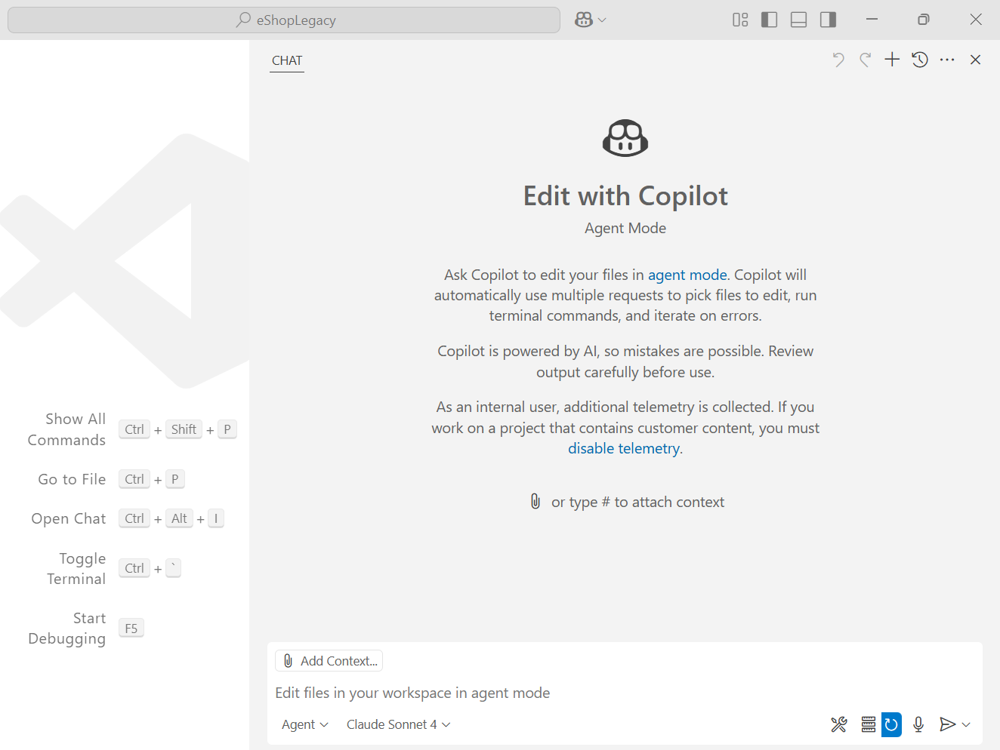
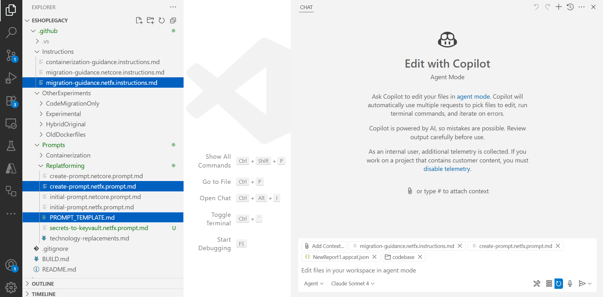

## Create Technology Specific Prompt

This section represents on how to create and attach user defined prompts to create a new prompt which will be used for code remediation on a specific technology.

- Go to Github Copilot chat in visual studio code
- Use copilot on agent mode
- Select the LLM (Claude Sonnet 4 or Claude Sonnet 3.7 for best results).

  

- Create the below markdown files and add as context to the copilot chat:

1. Instruction markdown file ([Instruction file](./prompts/UserDefinedPrompts/migration-guidance.netfx.instructions.md))

	**Utility**: Instruction level prompt file gives the copilot a direction on how to work on .net migration or replatform scenarios into azure.

2. Prompt creation template markdown file ([Prompt Template](./prompts/UserDefinedPrompts/PROMPT_TEMPLATE.md))

	**Utility**: This file is used as a reference inside the below prompt creation markdown file.

3. Prompt creation markdown file ([Create Prompt](./prompts/UserDefinedPrompts/create-prompt.netfx.prompt.md))

	**Utility**: This file provides instruction with set of rules to copilot for creating a new prompt for migrating code from one specific technology to another.

4. App Cat Report Json File

	**Utility**: This file is used as a source of remediation issues and helps copilot to search and identify all applications, services, and dependencies related to specific azure services.

5. The Codebase to be migrated.

	**Utility**: This is the codebase that needs to be migrated to azure services.

   

#### Important:

See the full [Technology Replacements](./prompts/UserDefinedPrompts/technology-replacements.md) list for more information.

Save the prompts in the same repository where the codebase is present for copilot to access the files as a context.

---

[*Back to content*](README.md)