# Github Copilot Prompt Engineering Code Remediation for .Net Framework Applications on Azure


## Document Summary
  See the full [Document Summary](Document-Summary.md)
## Change Log
  Full change history is available in the [Change Log](Change-Log.md)


## Contents

- [**Introduction**](#introduction)
- [**Role and Responsibilities**](#role-and-responsibilities)
- [**Planning**](#planning)
- [**Pre-requisites**](#pre-requisites)
- [**Utilization of Prompts**](#utilization-of-prompts)
- [**Migration Steps of Github Copilot Using Prompt Engineering for Azure PaaS Services**](#migration-steps-of-github-copilot-using-prompt-engineering-for-azure-paas-services)
- [**Guide To Known Issues**](#guide-to-known-issues)
- [**References**](#references)
- [**Abbreviations**](#abbreviations)


## 1. Introduction

This portion offers a concise overview of the process of remediate AppCat issues which are recommended to use relevant Azure PaaS components using GitHub Copilot Prompt Engineering.

### 1.1 Github Copilot Prompt Engineering

Prompt engineering is the process of crafting clear instructions to guide AI systems, like GitHub Copilot, to generate context-appropriate code tailored to your project's specific needs. This ensures the code is syntactically, functionally, and contextually correct.

Now that you know what prompt engineering is, let's learn about some of its principles.

### 1.2 Principles of Github Copilot Prompt Engineering

Before we explore specific strategies, let's first understand the basic principles of prompt engineering, summed up in the 4 Ss below. These core rules are the basis for creating effective prompts.

- #### Single: 
    Always focus your prompt on a single, well-defined task or question. This clarity is crucial for eliciting accurate and useful responses from Copilot.
- #### Specific: 
    Ensure that your instructions are explicit and detailed. Specificity leads to more applicable and precise code suggestions.
- #### Short: 
    While being specific, keep prompts concise and to the point. This balance ensures clarity without overloading Copilot or complicating the interaction.
- #### Surround: 
    Utilize descriptive filenames and keep related files open. This provides Copilot with rich context, leading to more tailored code suggestions.

    These core principles lay the foundation for crafting efficient and effective prompts. Keeping the 4 Ss in mind, let's dive deeper into advanced best practices that ensure each interaction with GitHub Copilot is optimized.

#### 1.3  Best practices in prompt engineering

- #### Provide enough clarity:
	Building on the 'Single' and 'Specific' principles, always aim for explicitness in your prompts. 

- #### Provide enough context with details:
	Enrich Copilot's understanding with context, following the 'Surround' principle. The more contextual information provided, the more fitting the generated code suggestions are.
    
- #### Provide examples for learning:
	Using examples can clarify your requirements and expectations, illustrating abstract concepts and making the prompts more tangible for Copilot.


## 2. Role and Responsibilities

| **Task**                        | **Responsible**     | **Accountable**     | **Consulted**           | **Informed**         |
|---------------------------------|----------------------|----------------------|--------------------------|----------------------|
| Assessment Report to be shared | Customer / Partner   | Customer / Partner   | Customer / Partner       | FACTORY              |
| Analysis Report Preparation     | FACTORY              | FACTORY              | Customer / FACTORY       | Customer / Partner   |
| Github Copilot Code Remediation Using Prompt Engineering    | FACTORY/Customer              | FACTORY/Customer              | FACTORY/Customer       | FACTORY/Customer   |

---

## 3. Planning

1. Ensure to run Azure migrate tool for assessment.
2. Ensure to identify all applications, services, and dependencies before migration to Azure cloud.

---

## 4. Pre-requisites

- Finalization of the applications to be migrated (Wave planning)  
- Run [Azure Migrate Tool](https://learn.microsoft.com/en-us/azure/migrate/appcat/dotnet?view=migrate-classic) for assessment - Identify all applications, services, and dependencies.
- To use GitHub Copilot, you can install the following Integrated Development Environments (IDEs):
  - [Visual Studio 2022 version 17.14 or newer](https://visualstudio.microsoft.com/downloads/)
  - [Visual Studio Code](https://code.visualstudio.com/)
- A GitHub account to connect your code editor to Copilot
  - [Sign in to Visual Studio using a GitHub account](https://learn.microsoft.com/en-us/visualstudio/ide/work-with-github-accounts) with [Copilot access](https://docs.github.com/copilot/about-github-copilot/what-is-github-copilot#getting-access-to-copilot).
 - Supported subscription plans:
  - Copilot Pro
  - Copilot Pro+
  - Copilot Business
  - Copilot Enterprise

- [Sign in to Visual Studio using a GitHub account](https://learn.microsoft.com/en-us/visualstudio/ide/work-with-github-accounts) with [Copilot access](https://docs.github.com/copilot/about-github-copilot/what-is-github-copilot#getting-access-to-copilot).

- Supported subscription plans:
  - Copilot Pro
  - Copilot Pro+
  - Copilot Business
  - Copilot Enterprise
- Code must be written in C#. 


## 5. Utilization of Prompts:

## 5.1 Github Copilot Sign in

Let’s sign in with Github Copilot Enterprise in Visual Studio Code.

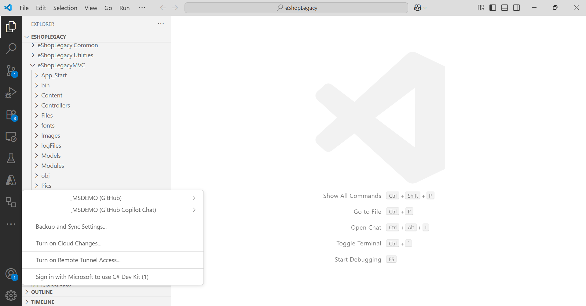

## 5.2 Run Azure Migrate Tool (AppCat):

1. Run Azure Migrate tool for assessment - Identify all applications, services, and dependencies related to specific Azure services.

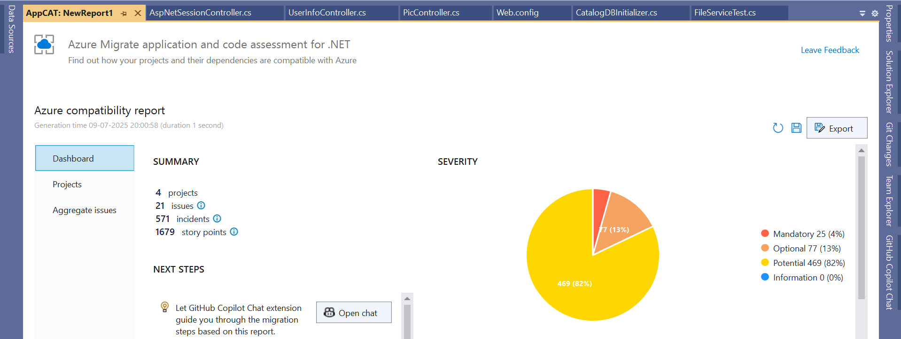


## 5.3 Execution of Prompts:

1. Create prompts using examples to guide AI systems effectively.
2. Utilize relevant details to ensure code suggestions are context-appropriate.
3. Ensure that your prompts are well-structured and follow the principles of prompt engineering.

There are two steps to create and execute the prompts on a specific technology code remediation as described below:

**STEP 1**:

Create a technology specific prompt.

**STEP 2**: 

Execute the newly created prompt to remediate the code issues for Target Technology integration:

We will analyze the these steps using specific Azure services below:

1. **Azure Key Vault**
2. **Azure Blob Storage**
3. **Azure Redis Cache**
4. **Microsoft Entra ID**


## 6. Migration Steps of Github Copilot Using Prompt Engineering for Azure PaaS Services:

## 6.1 Azure Key Vaults:

Let’s prepare an application which has hardcoded connection strings and passwords in the code.

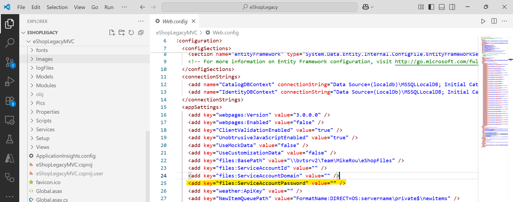

Let's see the AppCat report findings related to Azure Key Vault:

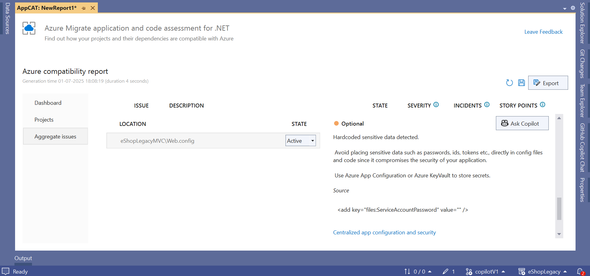


Let's proceed with **STEP 1** i.e., [Create-Technology-Specific-Prompt](Create-Technology-Specific-Prompt.md) to create and attach necessary files as a context in copilot chat which will be used to create prompt for Azure Key Vault integration.

Once the files in copilot chat are attached, tell copilot to remediate and apply the code changes for the AppCat issues related to hardcoded secrets (i.e., Technology X) issue using Azure Keyvault (i.e., Technology Y) as a next step.
In background copilot will follow the guidance provided in the instruction file and will generate a new prompt which will be followed to remediate the specific issues.

**Example**, we can ask copilot to remediate the hardcoded secrets issue using the below command:

```bash
Please execute #file:[YourPromptCreationFileName].md using "secrets in web.config" as "Technology X" and "Azure Key Vault" as "Technology Y".

You can use the AppCat report #file:[YourAppCatFileName].appcat.json  and look at issue Security.0003 to see specific locations in the solution where hard-coded secrets need to be replaced.
```

 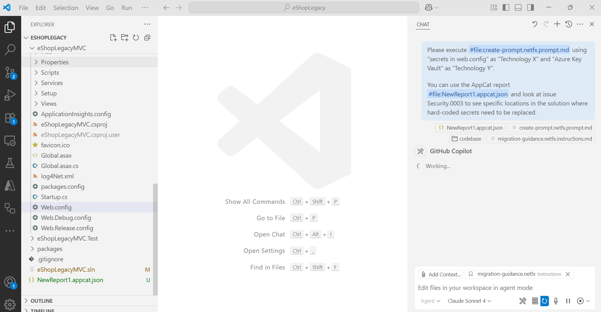

This will generate a new prompt for code remediation on Azure Key Vault integration.

 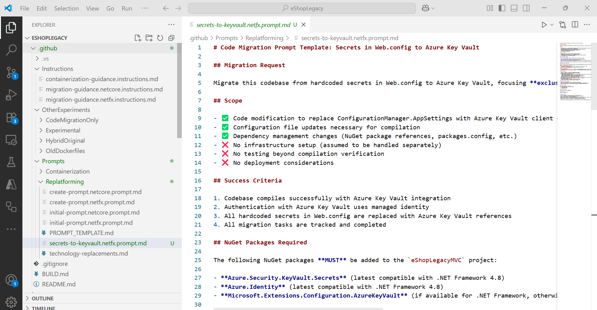

**Example**, please see the full copilot generated prompt for Azure Key Vault integration [Key Vault Prompt](./prompts/CopilotGeneratedPrompts/secrets-to-keyvault.netfx.prompt.md) 


Now, we have successfully created a prompt for Azure Key Vault integration. Let's proceed with STEP 2 i.e., the execution of the prompt to remediate the hardcoded secrets issue.

See the steps [Run-KeyVault-Technology-Specific-Prompt](Run-KeyVault-Technology-Specific-Prompt.md)


## 6.2 Azure Blob Storage:

Let’s prepare an application which has System.IO.File references with file access dependencies of server in the code.

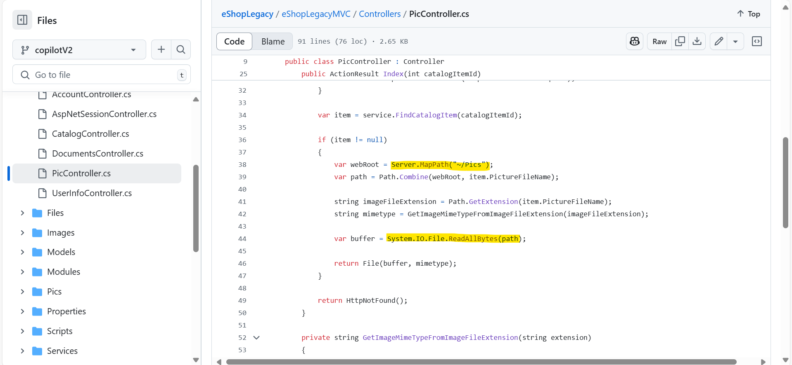

Let's see the AppCat report findings related to Azure Blob Storage:

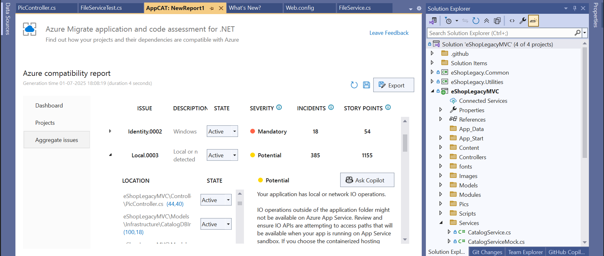

Let's proceed with STEP 1 i.e., [Create-Technology-Specific-Prompt](Create-Technology-Specific-Prompt.md) to attach necessary files which will be used to create prompt for Azure Blob Storages.

Once the files in copilot chat are attached, tell copilot to remediate and apply the code changes for the AppCat issues related to Local file system IO (i.e., Technology X) issue using Azure Blob Storage (i.e., Technology Y) as a next step.
In background copilot will follow the guidance provided in the instruction file and will generate a new prompt which will be followed to remediate the specific issues.

**Example**, we can ask copilot to remediate the Local file system IO issue using the below command:

```bash
Please execute #file:[YourPromptCreationFileName].md using "Local file system IO" as "Technology X" and "Azure Blob Storage" as "Technology Y".

You can use the AppCat report #file:[YourAppCatFileName].appcat.json  and look at issue Local.0003 to see specific locations in the solution where Local file system IO need to be replaced.
```

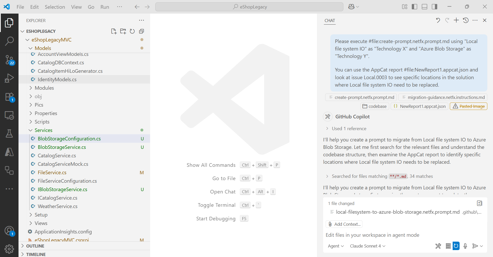

This will generate a new prompt for code remediation on Azure Blob Storage integration.

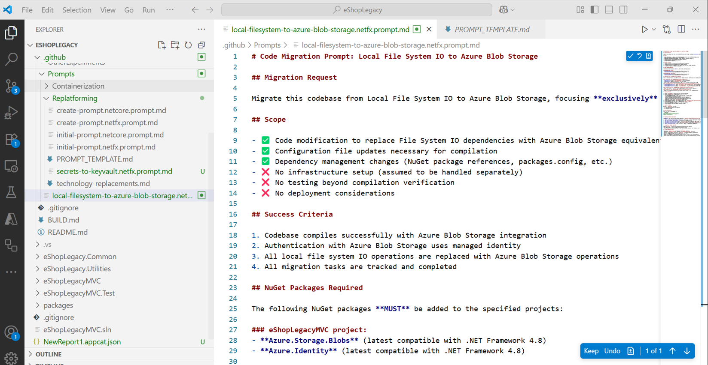

**Example**, please see the full copilot generated prompt for Azure Blob Storage integration [BlobStorage Prompt](./prompts/CopilotGeneratedPrompts/local-filesystem-to-azure-blob-storage.netfx.prompt.md) 

Now, we have successfully created a prompt for Azure Blob Storage integration. Let's proceed with STEP 2 i.e., the execution of the prompt to remediate the Local file system IO issue.

See the steps [Run-BlobStorage-Technology-Specific-Prompt](Run-BlobStorage-Technology-Specific-Prompt.md)

 ## 6.3 Azure Redis Cache:

 Let’s prepare an application which has Local caching references and dependencies in the code.

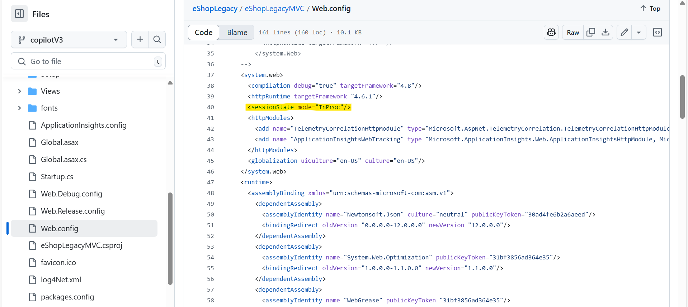

Let's see the AppCat report findings related to Azure  Redis Cache:

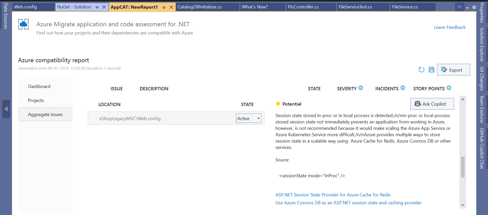

Let's proceed with STEP 1 i.e., [Create-Technology-Specific-Prompt](Create-Technology-Specific-Prompt.md) to attach necessary files which will be used to create prompt for Azure Redis Cache.

Once the files in copilot chat are attached, tell copilot to remediate and apply the code changes for the AppCat issues related to Local caching (i.e., Technology X) issue using Azure Redis Cache (i.e., Technology Y) as a next step.
In background copilot will follow the guidance provided in the instruction file and will generate a new prompt which will be followed to remediate the specific issues.

**Example**, we can ask copilot to remediate the Local caching issue using the below command:

```bash
Please execute #file:[YourPromptCreationFileName].md using "Local caching" as "Technology X" and "Azure Redis Cache" as "Technology Y".

You can use the AppCat report #file:[YourAppCatFileName].appcat.json  and look at issue Scale.0002 to see specific locations in the solution where Local caching need to be replaced.
```

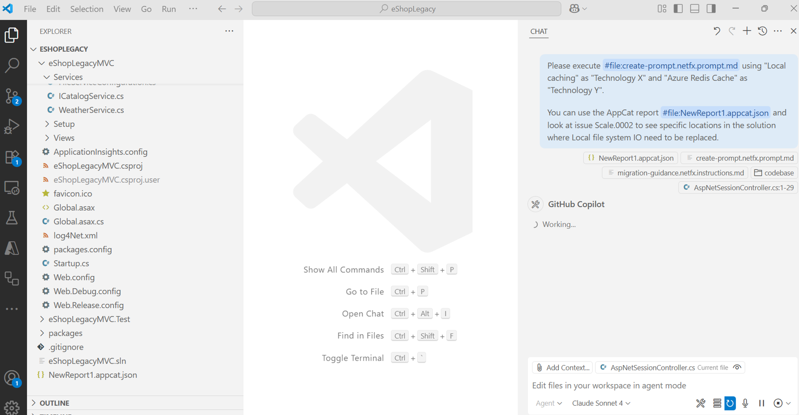

This will generate a new prompt for code remediation on Azure Redis Cache integration.

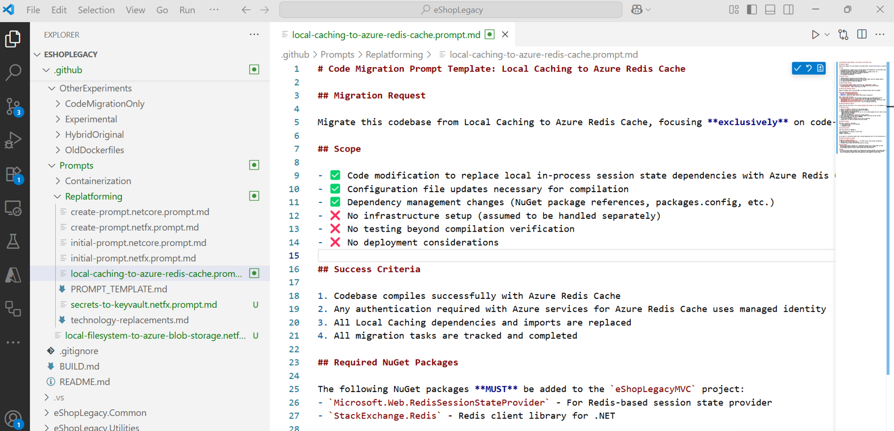

**Example**, please see the full copilot generated prompt for Azure Redis Cache integration [Redis Prompt](./prompts/CopilotGeneratedPrompts/local-caching-to-azure-redis-cache.prompt.md) 

Now, we have successfully created a prompt for Azure Redis Cache integration. Let's proceed with STEP 2 i.e., the execution of the prompt to remediate the Local caching issue.

See the steps [Run-RedisCache-Technology-Specific-Prompt](Run-RedisCache-Technology-Specific-Prompt.md)

## 6.4 Microsoft Entra ID:

Let’s prepare an application which has Windows auth for authenticating users references and dependencies in the code.

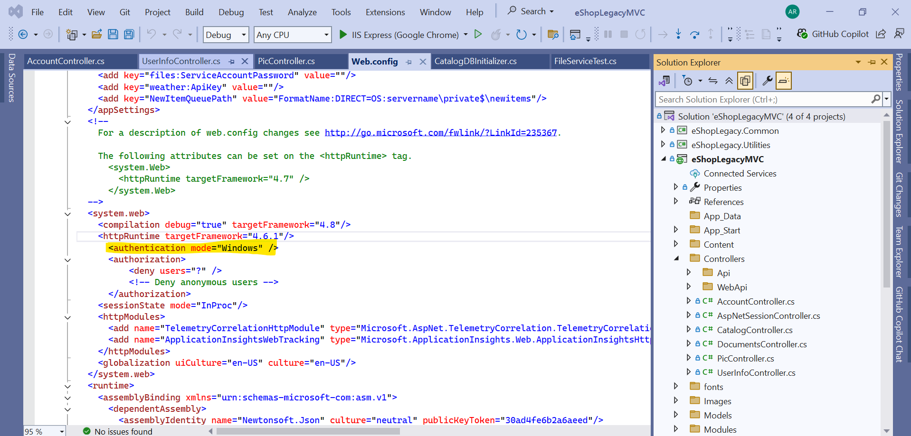

Let's see the AppCat report findings related to Entra ID:

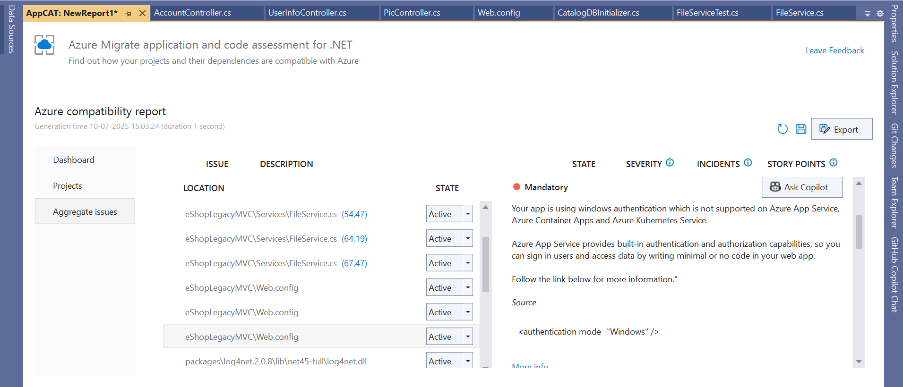

Let's proceed with STEP 1 i.e., [Create-Technology-Specific-Prompt](Create-Technology-Specific-Prompt.md) to attach necessary files which will be used to create prompt for Microsoft Entra ID.

Once the files in copilot chat are attached, tell copilot to remediate and apply the code changes for the AppCat issues related to Windows authentication (i.e., Technology X) issue using Microsoft Entra ID (i.e., Technology Y) as a next step.
In background copilot will follow the guidance provided in the instruction file and will generate a new prompt which will be followed to remediate the specific issues.

**Example**, we can ask copilot to remediate the Windows authentication issue using the below command:

```bash
Please execute #file:[YourPromptCreationFileName].md using "Windows authentication" as "Technology X" and "Microsoft Entra ID" as "Technology Y".

You can use the AppCat report #file:[YourAppCatFileName].appcat.json  and look at issue Identity.0002 to see specific locations in the solution where Windows authentication need to be replaced.
```

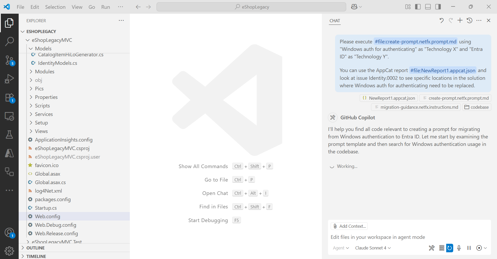

This will generate a new prompt for code remediation on Microsoft Entra ID integration.

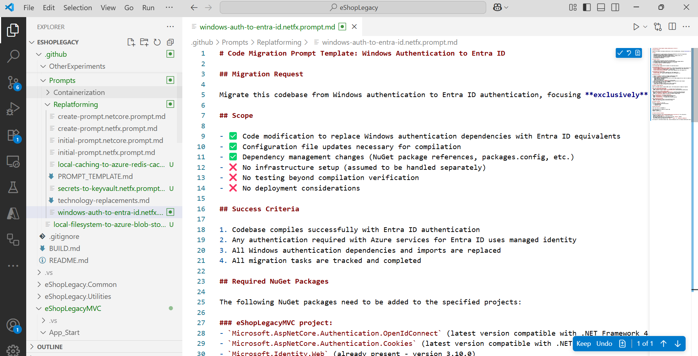

**Example**, please see the full copilot generated prompt for Microsoft Entra ID integration [Entra ID Prompt](./prompts/CopilotGeneratedPrompts/windows-auth-to-entra-id.netfx.prompt-manually-modified.md) 

Now, we have successfully created a prompt for Microsoft Entra ID integration. Let's proceed with STEP 2 i.e., the execution of the prompt to remediate the Windows authentication issue.

See the steps [Run-EntraID-Technology-Specific-Prompt](Run-EntraID-Technology-Specific-Prompt.md)

**Note** -

Once the build is completed successfully after each migration, you can check and confirm the running status of your application.
 
#### 7. Guide To Known Issues - 

1. msbuild/dotnet build issue: If you encounter any build issues, please ensure that the correct version of the .NET framework is installed on your machine. Even though it is instructed to copilot in guidance file to use  "msbuild" to build the application post migration, sometime it fails, hence copilot uses "dotnet build" command to build the application.

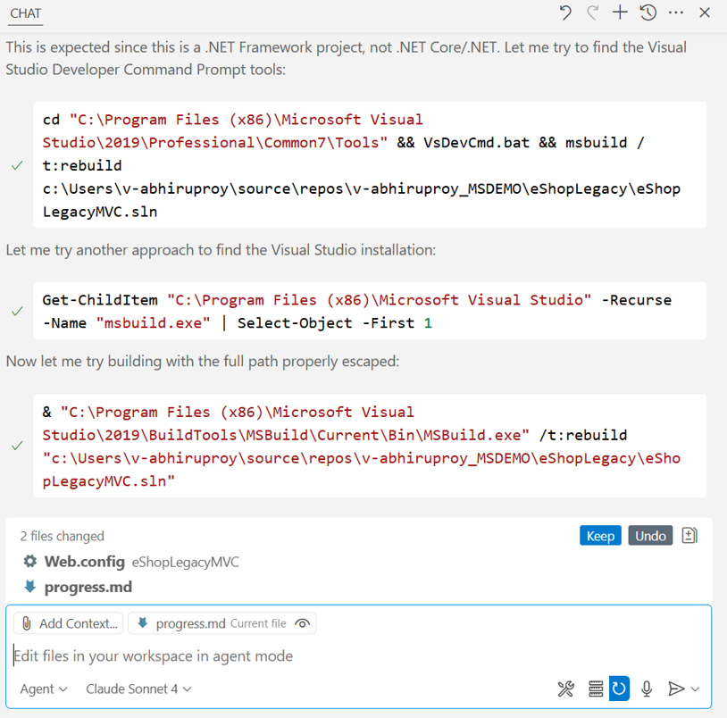

2. Continue option : Copliot sometimes provides the option to continue the code changes in the same prompt and the execution stops, in that scenario please review the code changes and continue if needed. Copilot works better in smaller scope of commands, so it is recommended to clear the chat and try again with new copilot chat window.

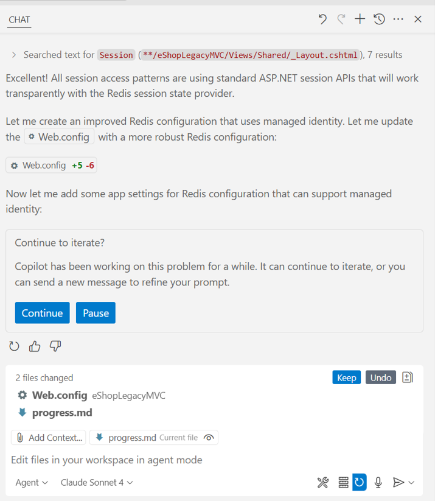

3. Claude Sonnet 4 & 3.7 : It is recommended to use the the LLM Claude Sonnet 4 but sometimes copilot fails to execute the code changes in middle of migration, in this scenario, review your changes carefully and use other option like Claude Sonnet 3.7 which also works well.

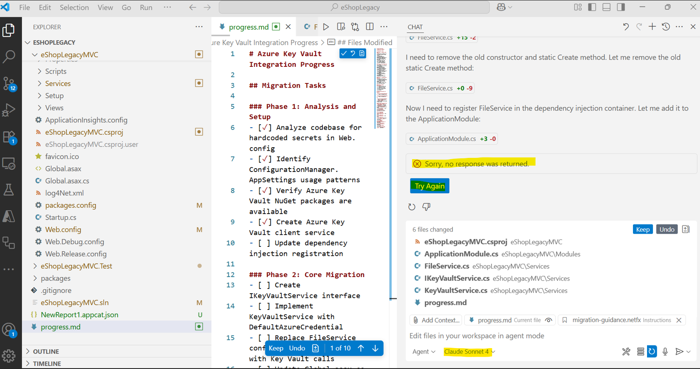

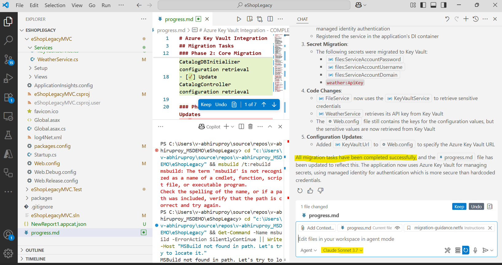


4. Manual code changes needed code errors : Sometimes copilot generates the code changes which are not syntactically correct and build issue occurs, in that scenario, please review the code changes and make the manual changes as needed.

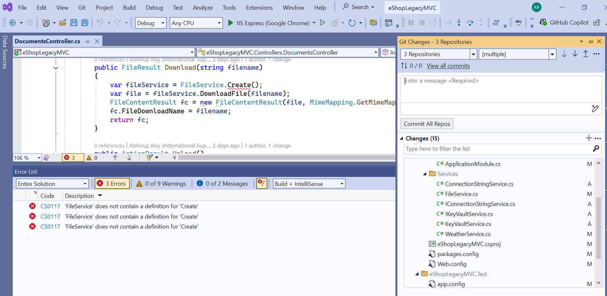

5. Visual Studio Code and Visual Studio both IDEs are required : Visual Studio Code required to execute the commands adding context of the targeted codebase, Visual Studio is required to install nuget packages using nuget package manager which is more user friendly.

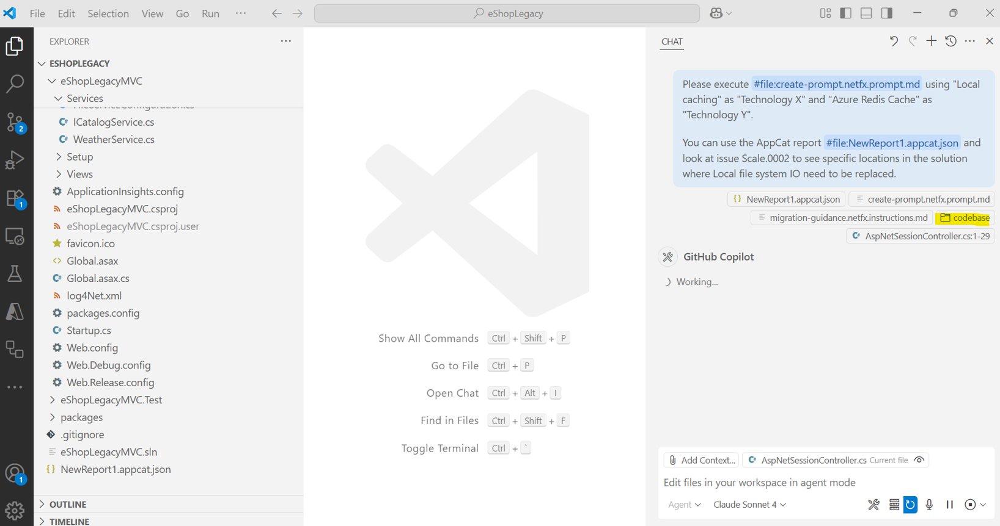
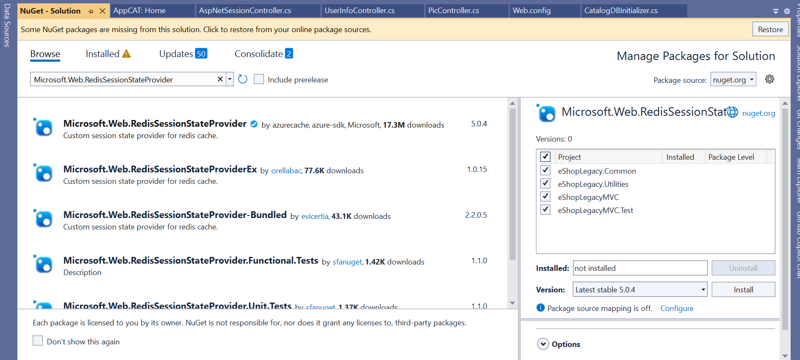

6. New branch creation : Copilot code remediation using prompt does not create a new branch like copilot for .net upgrade does, we have to manually create a new branch where coplilot code changes can be performed, later on, we can merge the changes to the main branch.

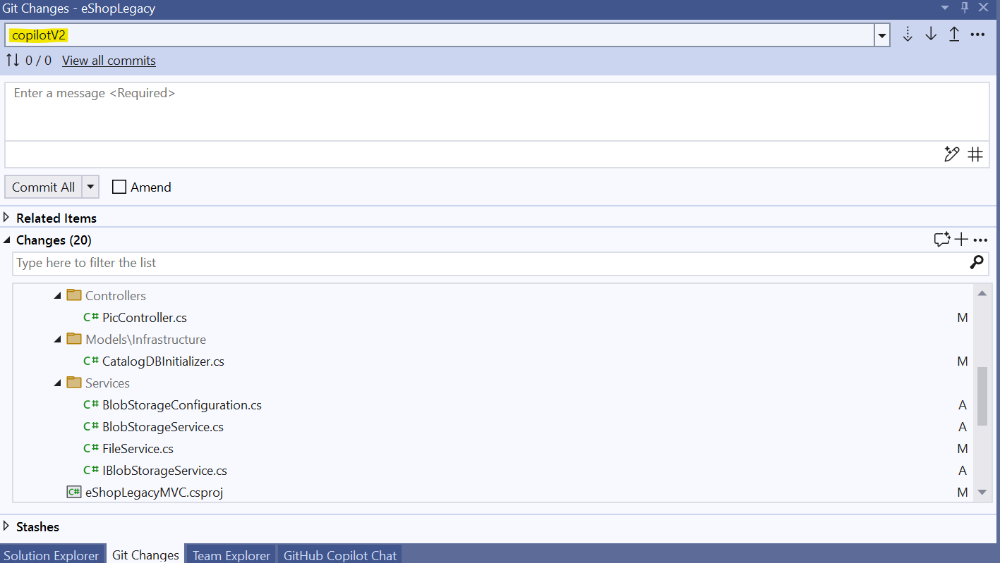

7. Manual Modification on Copilot Generated Prompts : Sometimes copilot generated prompts may need manual modification to make it more accurate and relevant to the specific code remediation task. It is recommended to review the generated prompt and make necessary modifications before executing it.

 Example: Copilot generated prompt for Microsoft Entra ID integration [Copilot Generated Entra ID Prompt](./prompts/CopilotGeneratedPrompts/windows-auth-to-entra-id.netfx.prompt-copilot.md)
 which does not work in .net framework, hence manual modification is required to make it work in .net framework before executing it for code remediation.
 The modified prompt for Microsoft Entra ID integration [Manually Modified Entra ID Prompt](./prompts/CopilotGeneratedPrompts/windows-auth-to-entra-id.netfx.prompt-manually-modified.md)

### 8. References

1. [Copilot Prompt Engineering](https://learn.microsoft.com/en-us/training/modules/introduction-prompt-engineering-with-github-copilot/2-prompt-engineering-foundations-best-practices)
2. [Azure Key Vault Documentation](https://docs.microsoft.com/en-us/azure/key-vault/)
3. [Azure Blob Storage Documentation](https://docs.microsoft.com/en-us/azure/storage/blobs/)
4. [Azure Redis Cache Documentation](https://docs.microsoft.com/en-us/azure/azure-cache-for-redis/)
5. [Microsoft Entra ID Documentation](https://docs.microsoft.com/en-us/azure/active-directory/)


### 9. Abbreviations


| **Abbreviations**               | **Definition**       
|---------------------------------|----------------------|
| AppCat  | Azure Migrate application and code assessment|
| LLM     | Language Learning Model  |


