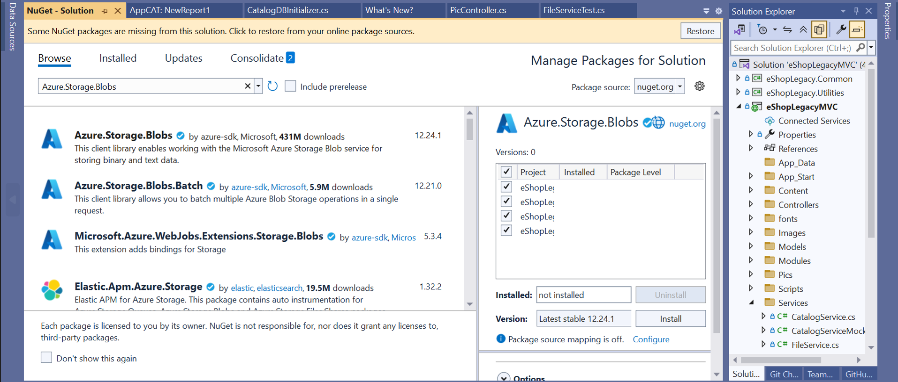
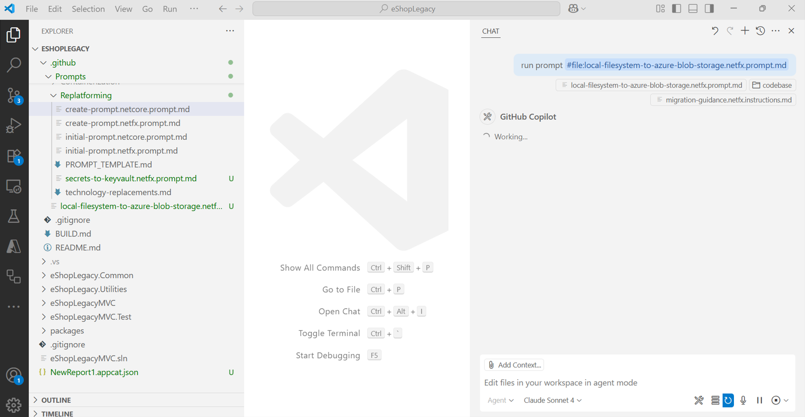
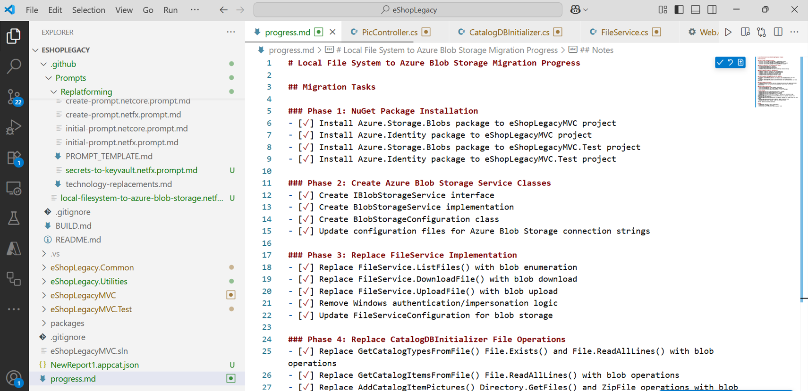
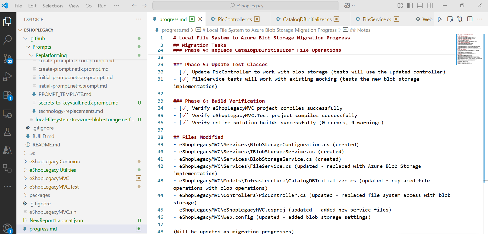
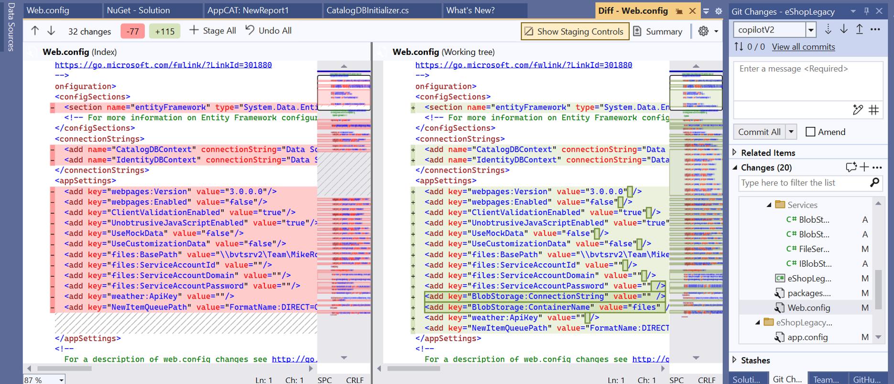
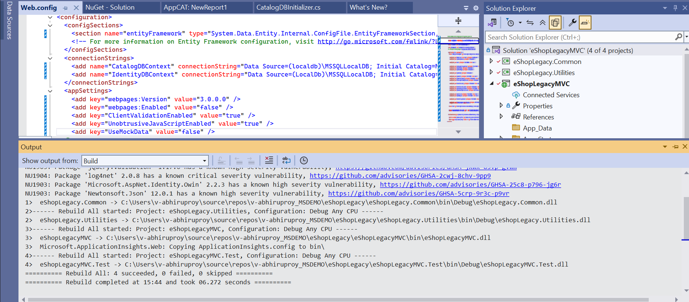

## Run Technology Specific Prompt for Azure Key Vault Integration:

This section represents on how to execute the newly created prompt for code remediation on a specific technology.

1. Download the packages mentioned in the newly created prompt from NuGet package manager manually.
    
   

- Add the below as context to the copilot chat:

1. Instruction markdown file.
2. The Codebase to be migrated.
3. Run the newly created prompt for code remediation on Azure Blob Storage integration.
   This will also generate a progress file to track the status of the code remediation process. Example: **See the full progress** [here](./prompts/BlobStorage-Progress/progress.md).

    

This will generate the necessary code changes to replace Local file system IO with Azure Blob Storage integration and will build the code as per instructions successfully.

   
   

Note: 
1. Ensure to verify the modified configuration file and application code.

    
    

2. Ensure to verify the build status and test the application post code changes; if there are any build or runtime issues, we may have to modify a few parts of the code manually depending on the build error.
   
   

3. Review the overall integration with Azure Blob Storage to ensure successful implementation.

---

[*Back to content*](README.md)