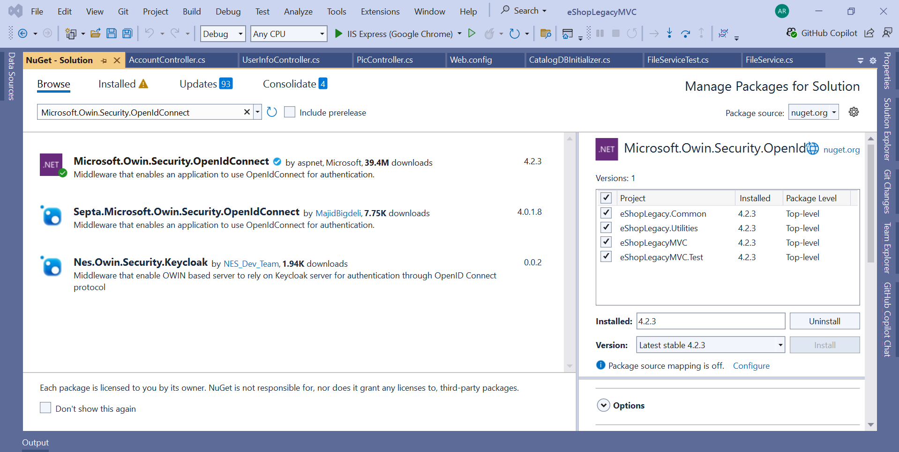
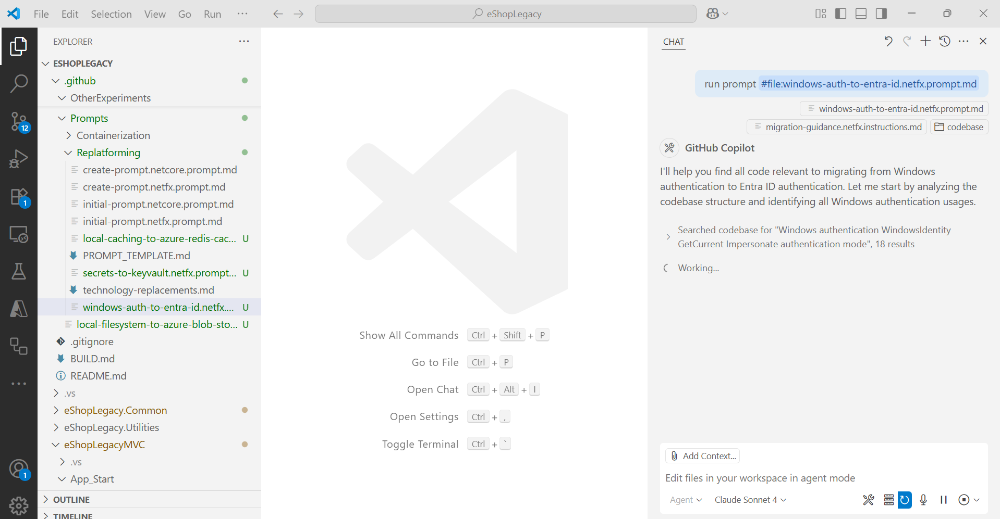
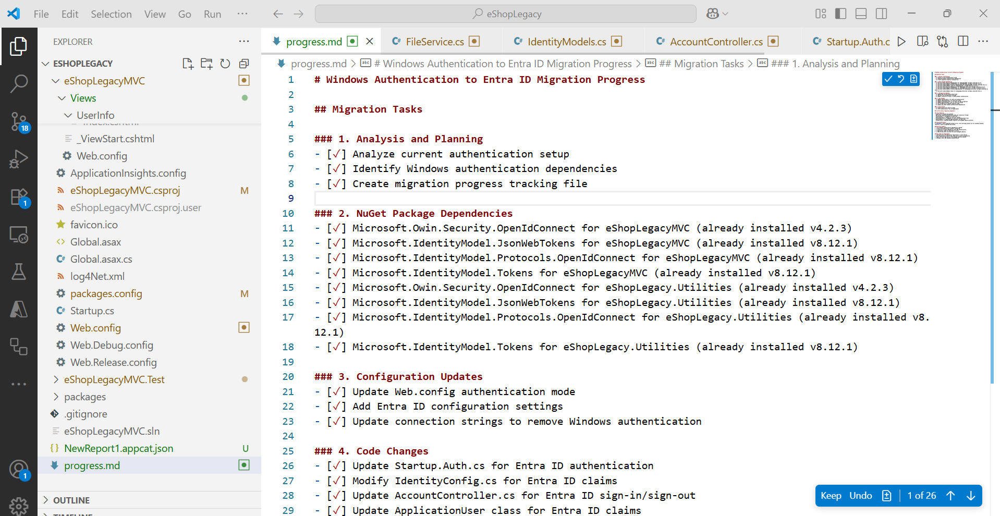
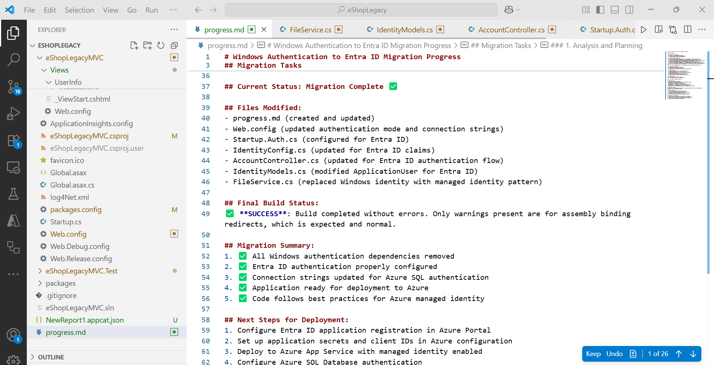
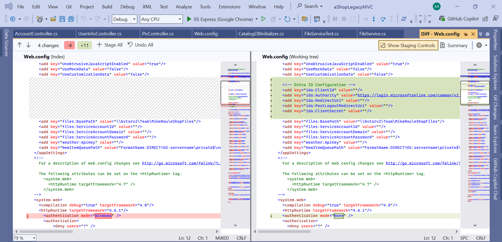
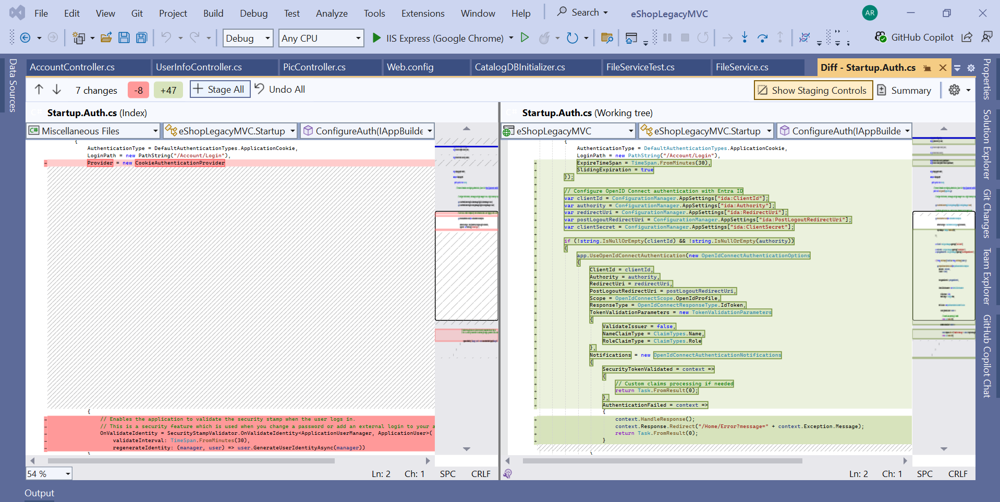
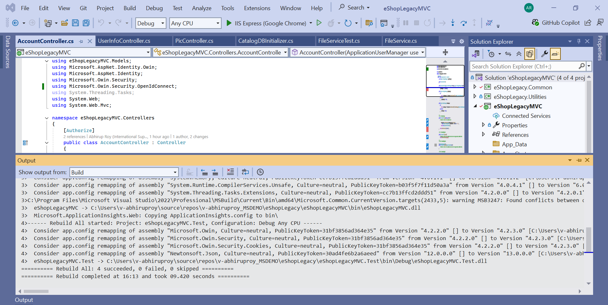

## Run Technology Specific Prompt for Microsoft Entra ID Integration:

This section represents on how to execute the newly created prompt for code remediation on a specific technology.

1. Download the packages mentioned in the newly created prompt from NuGet package manager manually.
    
   

- Add the below as context to the copilot chat:

1. Instruction markdown file.
2. The Codebase to be migrated.
3. Run the newly created prompt for code remediation on Microsoft Entra ID integration.
   This will also generate a progress file to track the status of the code remediation process. Example: **See the full progress** [here](./prompts/EntraID-Progress/progress.md).

    
This will generate the necessary code changes to replace Windows authentication with Microsoft Entra ID integration and will build the code as per instructions successfully.

    
    

Note: 
1. Ensure to verify the modified configuration file and application code.

    
    

2. Ensure to verify the build status and test the application post code changes; if there are any build or runtime issues, we may have to modify a few parts of the code manually depending on the build error.
   
   

3. Review the overall integration with Microsoft Entra ID to ensure successful implementation.

---

[*Back to content*](README.md)